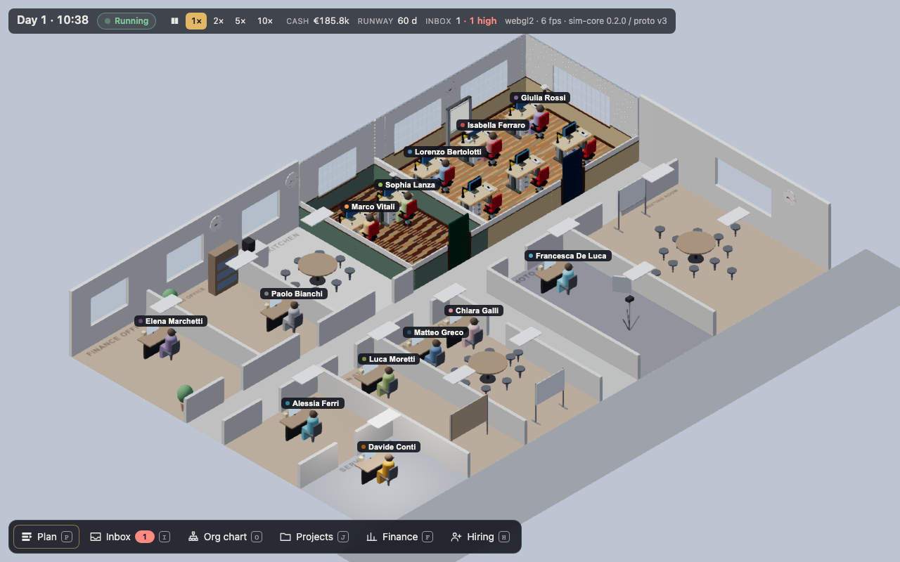
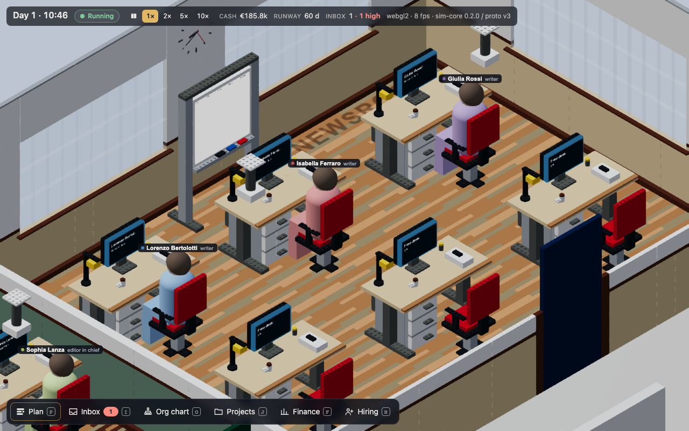

# Brick office spike: first measurements (FEAT-081)

> **Date:** 2026-10-04 · **Commit:** 9fcd521 (measured) · **Decisions:** ADR-0063, ADR-0064, ADR-0065 ·
> **Design:** [`docs/design/brick-office.md`](../design/brick-office.md) section 8 ·
> **Status:** the counts and build times below are real; **the frame times are not the go/no-go
> numbers.** They come from headless Chromium on SwiftShader (software WebGL2), not from Chrome with
> WebGPU on the M3 Max's GPU. The owner's run (section 5) decides.

## 1. What was built

Behind `?office=bricks` (and `office=bricks` on `bench.html`), `apps/game/src/render/bricks/`:

- **Loader.** `kit-wasm` is a lazy chunk (Vite alias `kit-wasm` → `crates/kit-wasm/pkg`), loaded
  only with the flag. `roomShells(layout_json)` gives each room's shell designs; every layout desk,
  its monitor and lamp (on the desk's `screen` and `lamp` ports), its chair (on the `seat` port), the
  ceiling lights and the free props go through `kit/mapping.json` to `compileShipped(design)`, at the
  layout's position and the sim's quarter turn. Each design is compiled once per page.
- **Chunks.** One thin-instanced mesh per region, colour and template shape per room (box or
  cylinder templates scaled per instance from `groupTransforms`), one stud mesh per region and
  colour (`setStuds(false)` drops them). Regions serve the cutaway: walls on the lot's boundary are
  cut away by the box office's rule (ADR-0005); interior walls are drawn to partition height (1.1 m),
  as the box office's partitions are. One PBR material per palette colour; glowing colours are
  emissive; the bulbs have one material per room, lit by the room's light level from the render state.
- **Scope.** The newsroom and the editor's office are bricks; the box office's meshes in those two
  rooms are switched off; every other room, the people, the labels and the lights are today's.
- **Surfaces** (FEAT-082). A plane in front of each desk monitor's screen (8 in the two rooms) and the
  newsroom whiteboard. Far: a glow from the render state (monitor on, the sitter's pose and work
  item). Close (≥ 72 px wide on screen): a canvas view (name, job, stage; the Plan's items in five
  columns by phase) from the overlay's store, drawn with `fillText` only and uploaded as raw pixels
  (`RawTexture.update`, never `copyExternalImageToTexture`). At most four redraws a frame,
  round-robin, only visible surfaces whose content changed.
- **Determinism.** The same layout gives byte-identical instance buffers (NullEngine test).





## 2. Measurements on this machine

Apple M3 Max (shared machine, other builds running), macOS, Playwright's Chromium 141 headless,
**WebGL2 on SwiftShader** (`ANGLE (Google, Vulkan 1.3.0 (SwiftShader Device …))`), 1280 × 800,
`bench.html?llm=fake&suite=frames`, idle window 8 s, scripted answers 40 ms. Produced by
`e2e/bricks-bench.spec.ts`; the `cockpit.benchmark.v1` documents are
`artifacts/bench/frame-time-bricks-{low,medium,high}.webgl2.json` (git-ignored, every timing marked
`inconclusive` with the reason).

| Tier | Office | Bricks | Studs | Brick meshes | Draw calls | Idle p50 | Idle p95 | Generating p95 | Frames (idle/gen) |
|---|---|---|---|---|---|---|---|---|---|
| low | boxes | – | – | – | 384 | 24.7 | 28.6 | 26.4 | 319/69 |
| low | bricks | 9736 | 1106 | 69 | 373 | 143.2 | 157.1 | 146.1 | 56/46 |
| medium | boxes | – | – | – | 612 | 55.3 | 56.9 | 56.7 | 139/46 |
| medium | bricks | 9736 | 1106 | 69 | 594 | 287.2 | 397.2 | 298.0 | 28/46 |
| high | boxes | – | – | – | 617 | 66.4 | 88.4 | 70.4 | 113/46 |
| high | bricks | 9736 | 1106 | 69 | 599 | 287.4 | 372.2 | 295.4 | 28/46 |

Frame times in ms. Draw calls are Babylon's count for the last frame of the run (all passes).

| Room | Bricks | Studs | Meshes | Kit compile | Mesh build | Chunk build |
|---|---|---|---|---|---|---|
| newsroom (8 × 6 m, 27 placements) | 6151 | 844 | 38 | 29–31 ms | 14–16 ms | 45–46 ms |
| editor's office (4 × 6 m, 9 placements) | 3585 | 262 | 31 | 7 ms | 5–17 ms | 12–25 ms |

- Kit compile is the room's shell chunks plus the designs not yet compiled for an earlier room (the
  newsroom pays for the desk, chair, monitor and lamp designs once).
- `roomShells(layout)` makes the shell designs of all eleven rooms at once: 22 ms.
- Loading the kit (fetch and compile of the 572 kB module, 170 kB gzip) took 2.3 s on the first, cold
  run behind `vite preview` on this machine's slow disk, and 4–5 ms from the cache afterwards.
- Measured in the browser with the release module (`cargo xtask wasm --release`).

### Reading the frame times

- SwiftShader rasterises on the CPU: ten thousand instanced boxes (and about 1,100 studs and some
  cylinders) cost it six times the box office. A GPU draws the same in one instanced call per mesh;
  these numbers say nothing about WebGPU on the M3 Max.
- Draw calls do not grow: the two brick rooms replace dozens of separate box meshes (desks, chairs,
  props, walls) with 69 instanced meshes.
- The scripted backend does not use the GPU; its "generating" phase is the harness's own work.
  The real generation load (Bonsai on WebGPU, ADR-0057) is the owner's run.
- GPU memory is not measured here (the harness has no reading under SwiftShader).

## 3. Against the go/no-go criteria (section 8.5)

| Criterion | Target | Measured here | Verdict |
|---|---|---|---|
| Idle frame p50, low / medium / high | ≤ 16.7 ms (60 fps) | 143 / 287 / 287 ms (SwiftShader) | inconclusive |
| Frame p95 while generating, lowest tier | ≤ 50 ms | 146 ms (SwiftShader, scripted load) | inconclusive |
| Chunk build, newsroom | < 200 ms | 45 ms | **go** |
| Chunk build, editor's office | < 200 ms | 12–25 ms | **go** |
| Brick count for two rooms | (about 50,000 visible bricks budgeted for the office) | 9,736 bricks, 1,106 studs | within |

The chunk build is measured on the target CPU (in headless Chromium, release wasm) and passes with
a wide margin. The frame-time rows wait for the owner's run.

## 4. What the spike found

- **Shared geometry under WebGL2.** Thin-instanced meshes that share one `Geometry` share its cached
  vertex array object, so all but one drew another mesh's instances. Each mesh now gets its own
  copy of the template's vertex data (24 vertices for a box); a test checks it.
- **The kit's window module** (`window-4x1x18`) has no pane: the shells' windows came out as solid
  blocks in the style's window colour. The renderer draws the `window` template in `glass`; a pane
  part or a frame-and-glass template in the kit would be cleaner (kit issue, not changed here).
- **No whiteboard in the demo newsroom.** The sim's demo layout has whiteboards only in the meeting
  and strategy rooms. The spike stands a whiteboard design against the newsroom's north wall,
  marked `standIn`; a layout whiteboard replaces it. Placing one is a sim layout change for later.
- **Ceiling lights** hang at the shell's wall top (2.9 m); there is no ceiling to hang from.
- **Shells for one room** need the doorways of the neighbours' doors; `roomShells` computes them for
  the whole layout (22 ms). A per-room call with doorways would let a room rebuild alone.
- **Floor height.** The shells' floor top is 5 cm above their base; the renderer lowers the shells so
  the floor's top is at y = 0, where people walk and the box office's floors are.

## 5. The owner's run on the M3 Max (go/no-go)

Installed Chrome, headed, WebGPU on the real GPU, the scripted load first:

```sh
cargo xtask wasm --release
BRICKS_TARGET=1 BRICKS_CHANNEL=chrome BRICKS_RENDERER=webgpu \
  pnpm --filter @swarm-press/game exec playwright test -c playwright.bonsai.config.ts --project=bricks
```

It builds the harness, opens
`http://localhost:4178/bench.html?llm=fake&suite=frames&quality=<tier>&office=<boxes|bricks>&idle=8&fakems=40&memory=0&autostart=1`
for each tier and office, and writes `artifacts/bench/frame-time-bricks-<tier>.webgpu.json` and
`artifacts/bench/bricks-spike.webgpu.md` with the verdicts (timings count only with
`BRICKS_TARGET=1` and WebGPU).

With the real model generating (the criterion "p95 ≤ 50 ms while generating at the scheduler's
lowest tier"), open the harness by hand in Chrome:
`http://localhost:4178/bench.html?llm=bonsai&suite=frames&quality=low&office=bricks` (after
`pnpm --filter @swarm-press/game exec vite build --mode harness && pnpm --filter @swarm-press/game exec vite preview --mode harness --port 4178`,
and the Bonsai engine installed, `docs/runbooks/model-qualification.md`), press Start, and compare
its frame report with the same URL at `office=boxes`. To look at the game itself:
`http://localhost:5173/?office=bricks` under `pnpm dev`.
