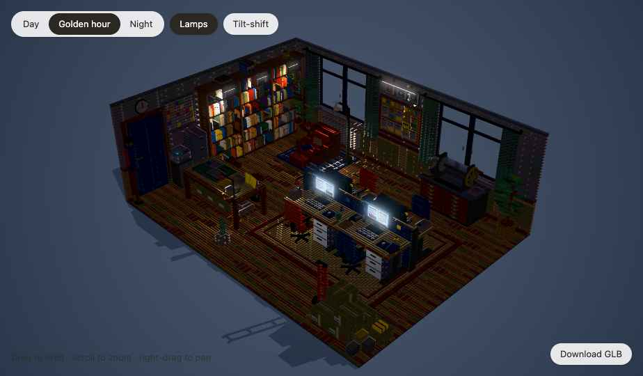
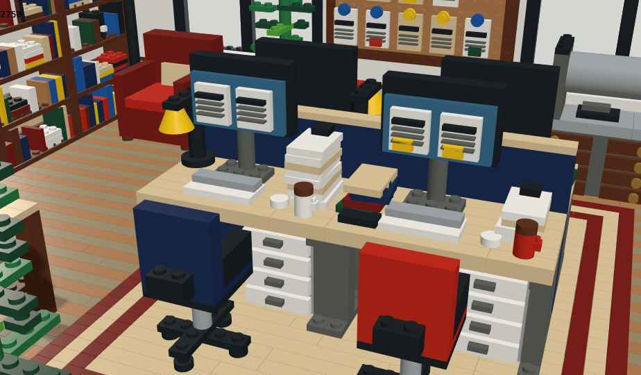
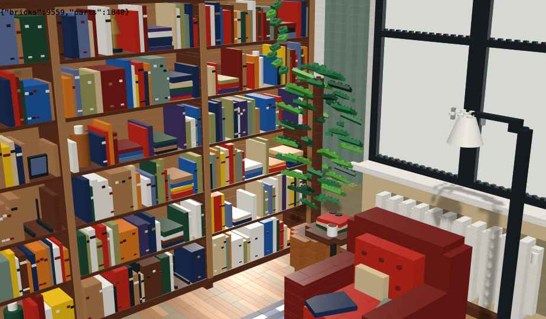

# Brick office: the visual concept

> **Status:** reference concept, received from the owner on 2026-10-03 as
> `3d-design-idea/visual-core-idea.md` with a Babylon.js prototype. Decisions taken from it are in
> [ADR-0063](../adr/0063-brick-office-and-live-information-surfaces.md) (the brick office and live
> information surfaces) and [ADR-0064](../adr/0064-webgpu-only.md) (WebGPU only). The design for
> swarm.press is [`docs/design/brick-office.md`](../design/brick-office.md).
>
> The concept was written for a book publisher (manuscripts, print runs, shipping). This copy
> keeps its ideas and adds, in brackets, what each one means in swarm.press, which publishes a
> website: briefs, drafts, reviews, pull requests and deploys.



## 1. Pitch

A brick-built simulation of a living publishing house. Every room is a real brick model: walls,
desks, books and lamps are standard bricks, plates and tiles. The staff work on their own. The
player never steers a person; they shape the world: rebuild rooms, add rooms and floors, and set
the direction of the house.

Every surface tells the truth. Zoom into a monitor and you see what that editor is working on right
now. Zoom into the whiteboard and you read the real production schedule. The model *is* the
interface.

**One line:** a brick-built publishing house that runs by itself, where every screen, board and
stack shows what is really happening.

## 2. What the prototype proves

The prototype is kept at [`brick-office/prototype.html`](brick-office/prototype.html) (one page,
Babylon.js from a CDN; it uses the WebGL2 engine, while the product is WebGPU only).

| Area | State |
|---|---|
| Engine | Babylon.js 9, PBR materials |
| World grid | 128 × 96 studs of floor, 118 plates tall (1 stud ≈ 6.25 cm, 1 plate ≈ 2.5 cm of a real room), so one room is about 8 × 6 m |
| Parts | About 11,400: about 9,560 grid bricks, plates and tiles, and about 1,840 detail pieces |
| Brick logic | Shapes are made in a voxel grid, then split into real brick sizes with overlapping rows like real brickwork. Studs are drawn only where they are visible. |
| Rendering | One thin-instanced mesh per colour, so 11,000+ bricks run smoothly |
| Lighting | Day, golden hour and night. Sun with PCF shadows, 13 room lights, glowing bulbs and screens, SSAO, bloom, optional tilt-shift |
| Structure | Every brick belongs to a named object, such as `desk_3 › monitor` or `filing_and_printer › whiteboard` |
| Live-display surfaces | Monitors, whiteboard, proof wall, clock and printer display exist as named surfaces; they only need live content |



## 3. Pillars

1. **Simulation, not avatar control.** Staff act on their own. The player steers the house, never
   a person. [swarm.press already works this way: the CEO decides through tickets and policies.]
2. **Every surface tells the truth.** A brick that shows information shows real data. There is no
   decorative fake text.
3. **Zoom is the interface.** To find something out, move closer. [swarm.press keeps its panels
   for decisions; see ADR-0063.]
4. **Everything is bricks.** Anything visible can be rebuilt, moved or recoloured.
5. **Grow the house.** One room becomes a floor, a floor becomes a building.

## 4. Live information bricks (the core feature)

### 4.1 Principle

Some bricks are information bricks: screen tiles, whiteboard plates, paper tiles, clock faces and
display tiles. Each is linked to a data source. What it shows depends on the camera distance:

| Level | Distance | What you see |
|---|---|---|
| Far | Whole floor | Colour and glow only: a screen glows blue (working), amber (waiting) or dark (idle); a whiteboard shows coloured notes |
| Mid | Room | A blocky version made of bricks: progress bars, a grid of notes, the outline of a page. Readable shapes, no text. |
| Close | Object fills the view | Full live content: text, numbers and page previews, rendered sharply on the surface |

The change between levels is smooth, and the object always stays a brick model.

### 4.2 Catalogue

| Object | Data source in the concept | In swarm.press |
|---|---|---|
| Desk monitor | That worker's current task | The person's current job and stage, and the text being written (the section Giulia is drafting) |
| Whiteboard | Production schedule | The Plan: work items by phase (brief, draft, review, approval, published) |
| Proof wall | Pages in proofing | The article waiting for the CEO's approval, with the editor's marks |
| Framed covers | Best-selling titles | The best-performing published articles (tracker data) |
| Manuscript stacks | Submission queue | Briefs waiting to be written; height is the count |
| Wall clock | Simulation time | Game time |
| Proof press display | Print jobs | The deploy: current run, state, last published commit |
| Office printer screen | Print queue | Gateway activity: drafts and merges in flight |
| Desk phone | Communications | Open tickets for that person or the CEO |
| Shipping cartons | Orders | Published articles going live |
| Library shelves | Backlist | The site's existing pages; close up, a title and its route |
| Door sign | Room function | Room name, who is inside, current meeting |

### 4.3 Players place their own information bricks

Information bricks are part of the brick palette (screen tile 2×2 to 12×6, board plate 4×4 to
16×32, paper tile 1×2 to 4×6, display tile 1×1 to 2×4, clock face). After placing one, the player
links a data source, picks a view and optionally a filter:

```
whiteboard_2
  source:  production.schedule
  view:    kanban
  filter:  imprint = "Children's"
```

Players build their own control centres out of bricks: a wall of screens in the director's
office, a board in the hallway, a delay tracker by the press.

### 4.4 Interaction

- **Look:** zoom, or click to fly the camera to a surface. Content is read-only by default.
- **Inspect:** at close zoom, hovering an entry shows details; clicking follows the link (a note's
  item, then its brief, then its writer's desk).
- **Decide:** some surfaces offer house-level decisions, never personal steering: accept or decline
  a brief, reprioritise an item, approve a publish.

## 5. The simulation in the concept

Agents with stations (acquisitions editor, editor, designer, proofreader, printer, shipping clerk,
visitors) and needs (light, a seat, quiet, coffee). The player controls the space, the programme
(what is accepted, priorities), hiring (open positions, not who fills them) and where information
bricks go. The building affects the work: too little light slows a desk, long walks cost time,
noise disturbs reading, shelves and cabinets limit stock.

[swarm.press already has the staff, roles, stations, schedules, paths, morale and equipment in
`crates/sim-core`. How much of the building's effect on work becomes sim rules is open; see the
design document.]

## 6. Building

- **Brick by brick:** place (snap to studs, height in plates, ghost preview), remove, paint, rotate
  in 90° steps, copy and stamp, undo and redo; auto-merge into the largest standard bricks; box
  fill, disc and mirror tools.
- **Objects:** any group of bricks can be saved as a named object. Behaviour tags (`seat`,
  `workstation`, `light`, `storage`, `door`, `info-surface`) let the simulation recognise what was
  built; a desk counts as a workstation with a top, a seat within reach and a screen or paper tile.
- **New rooms:** open a doorway (at least 6 studs wide, 34 plates tall), claim the plot behind it,
  start from a template (archive, print shop, meeting room, sales office, reading café, mail room,
  director's office) or empty, size it in 32 × 32 baseplate steps, add floors with stairs or lifts.
  A room activates once it has the objects it needs (a meeting room needs a table, four seats and a
  door).

## 7. Systems design in the concept

- **World data:** a house holds the simulation state and floors; each room is a chunk with voxels
  (colour, tile flag, object id), detail parts, lights, surfaces (object, face, size, source, view,
  filter), a tree of named objects with tags, and portals to neighbouring rooms.
- **Information bricks in Babylon:** a flat panel in front of the brick face with a canvas texture;
  mid zoom is a brick mosaic (one brick per data pixel, instanced); far zoom is only the material's
  glow; close zoom draws a view template (kanban, page, chart, ticker, label) at 256 to 2048 px to
  match its size on screen. Only visible surfaces above a size threshold update, round-robin, about
  four per frame. A surface redraws only when its data changes or its zoom level does.
- **Rebuild after an edit:** re-split the changed region plus a one-cell border, rewrite the
  affected colour's instance buffer; target under 4 ms.
- **Performance targets:** 60 fps for about 50,000 visible bricks and 40 active surfaces.
- **Saving and sharing:** compressed voxels, parts, objects, lights and surface bindings; `.room`
  files whose bindings reconnect to the importing player's data; GLB export with a snapshot of each
  surface.



## 8. Controls (desktop)

Left-drag orbits, scroll zooms (and changes the information bricks' level), right-drag pans,
double-click flies to a surface, Esc backs out; 1–9 picks from the brick palette; left-click
places, right-click or Delete removes, R rotates, Alt-click picks a colour, Shift-drag fills or
selects; Ctrl-C and Ctrl-V copy and stamp; Space pauses, + and − change speed, T changes the time
of day, L toggles lamps.

[swarm.press uses an orthographic isometric camera with four snapped angles (ADR-0005), not a free
orbit; see the design document.]

## 9. Visual direction

- A toy-photo look: soft corner shading, warm lamps, optional tilt-shift.
- Information content in the house style: off-white paper, dark ink, one accent colour per
  section. It should read as printed on bricks, not as an app screen.
- Mid-zoom mosaics use only the classic brick colours, so they look built, not rendered.
- A small set of pill-shaped controls (time, speed, build mode).

## 10. The concept's roadmap

0. Prototype: one detailed room, three lighting modes, GLB export (done).
1. Live surfaces: zoom levels, canvas-texture screens, whiteboard and monitor views.
2. Simulation core: agents, titles, the pipeline, data feeding all surfaces.
3. Editor: place, remove, paint, partial rebuilds, undo, save and load.
4. Objects and tags: behaviour tags, workstation detection, placeable information bricks.
5. Rooms: doorways, new plots, templates, floors, room activation.
6. Sharing: `.room` files, gallery, snapshot export.

## 11. Open questions in the concept

- How many decisions should surfaces allow, versus being read-only?
- Should a monitor show real or generated text? [In swarm.press it shows the real text the staff
  member's job is producing.]
- Should surface data come only from the simulation, or also from real sources? [In swarm.press
  much of it is already real: the site, its pull requests, its deploys, its traffic.]
- Is auto-merge on by default?
- Platform: web first, then desktop and tablet wrappers?
