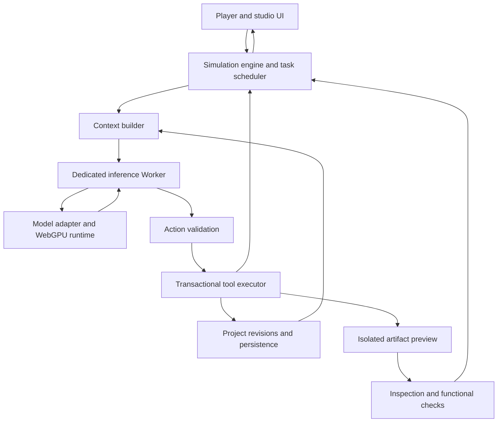
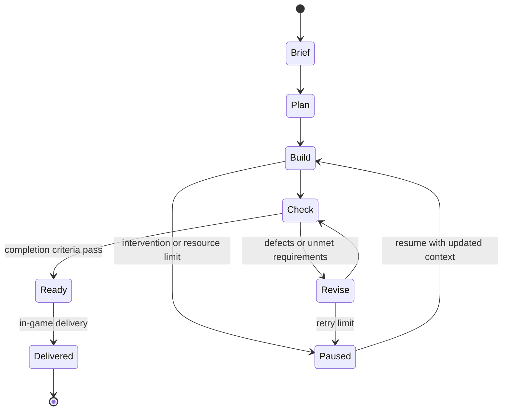

# Browser Agent Studio

## A WebGPU creation simulation that produces real publishable artifacts

**Working title:** Browser Agent Studio  
**Concept version:** 1.1  
**Date:** 2 October 2026  
**Status:** Product and technical proposal; performance targets require measurement.

## 1. Product premise

Browser Agent Studio is a simulation game in which the player runs a creative production studio staffed by AI characters. The studio accepts briefs, plans projects, builds artifacts, tests them, handles client revisions, and releases finished work. Its first artifact type is a static website. Later versions can support interactive stories, newsletters, lightweight dashboards, and other browser-native publications.

The artifacts are real. A completed website can be previewed, edited, downloaded, shared, and optionally deployed. Gameplay changes what gets created: a tight deadline, limited asset budget, demanding client, or specialist worker influences scope and execution.

The defining technical constraint is that **all language-model inference runs locally in the browser**. The strict WebGPU mode uses application-controlled WebGPU execution. An optional Chrome built-in AI mode uses the browser-managed local model and must be labeled separately: that API does not guarantee application-controlled WebGPU execution. The game needs neither an inference API nor a local native model server. Network services may distribute the application and model weights and optionally host published artifacts; they do not generate the agent's decisions.

The player sets direction and makes production decisions. The model chooses meaningful creative and technical actions. The simulation enforces resources, tools, workflow rules, and consequences.

## 2. Design pillars

| Pillar | Product implication |
| --- | --- |
| Real output | Every completed project produces a usable artifact and its source files. |
| Local intelligence | Briefs, source code, and agent inference stay on the user's device unless the player explicitly exports or publishes them. |
| Visible agency | Characters perform understandable actions whose results appear in the studio and artifact preview. |
| Reliable environment | The engine owns state, permissions, validation, accounting, and recovery. |
| Meaningful management | Player decisions change priorities, scope, style, resources, and client satisfaction. |
| Responsive experience | Model loading and inference have clear progress states; the UI remains usable throughout. |
| Replaceable models | The simulation depends on a runtime contract rather than a particular model implementation. |

## 3. Intended audience and initial positioning

The first audience is people who enjoy management simulations, creative tools, and experimenting with local AI. The initial technical audience is desktop users with sufficient GPU or unified memory and a compatible browser. Mainstream availability is a later goal, contingent on measurements and a smaller-model path.

Three use cases guide the product:

1. **Play:** manage a studio, satisfy briefs, and unlock harder projects.
2. **Create:** use the studio as an engaging way to build an actual website.
3. **Learn:** inspect edits, tests, and revisions to understand how a project develops.

The initial release should be honest about its hardware demands. A roughly six-gigabyte weight download is still a substantial requirement for a browser game.

## 4. Player fantasy and studio presentation

The player is the creative director. AI characters are workers with names, specialties, preferences, and visible assignments. The player sees a studio workspace, a project board, a client inbox, and a live artifact preview.

A character might be a designer, developer, editor, or reviewer. These are distinct role prompts and workflow permissions executed by **one shared resident model**, initially one turn at a time. Hiring four characters does not load four language models.

Worker progression unlocks better templates, specialized tools, or more responsibility. Traits alter behavior and project fit: a meticulous reviewer might request more checks; an experimental designer might propose unusual layouts. The UI should avoid presenting fictional skill levels as guarantees of underlying model competence.

The visual studio can start as a lightweight 2D interface with character animations. An elaborate 3D world is optional and would consume resources that the model also needs.

## 5. Core gameplay loop

1. **Accept a brief.** Read the client's purpose, audience, required features, style preferences, budget, and deadline.
2. **Choose a production approach.** Assign a worker, agree on scope, select available assets, and set priorities.
3. **Approve a milestone plan.** Review proposed sections, interactions, and completion criteria.
4. **Observe production.** The agent reads and edits files using semantic tools. The preview changes after committed edits.
5. **Review feedback.** Automated checks identify measurable defects; workers and the player assess communication and aesthetics.
6. **Handle revisions.** Trade additional polish against simulated time, money, and client expectations.
7. **Release the artifact.** Complete the in-game delivery, download the project, or choose an external publishing destination.
8. **Grow the studio.** Earn reputation and resources, unlock new briefs, and retain useful project knowledge.

Both guided missions and a freeform sandbox use the same artifact pipeline. The sandbox accepts the player's own brief and relaxes game constraints.

## 6. Economy, time, and progression

The simulation tracks money, reputation, simulated production time, and project scope. Actions have explicit game costs: purchasing an asset, commissioning a revision, running an extensive review, or accepting a rush job.

**Simulated time is separate from wall-clock inference time.** A slower GPU must not make the same project miss an in-game deadline. Assign game-time costs from action type and project complexity, then apply them when an action commits. Pause the simulation clock while downloading, recovering the GPU, or waiting for the player.

Difficulty increases through conflicting requirements, larger projects, existing code to repair, more demanding interaction behavior, and tighter resource tradeoffs. Avoid increasing difficulty merely by requiring longer model context.

Reputation is earned through observable delivery outcomes. A project that passes technical checks but communicates the wrong message should receive a different response from one with excellent messaging and broken navigation.

## 7. First supported artifact: static websites

The minimum viable product supports small static websites built from HTML, CSS, JavaScript, and approved assets. Projects can include landing pages, portfolios, event pages, product microsites, and simple interactive experiences.

MVP scope:

- One to three pages.
- Responsive layouts across a defined viewport set.
- Navigation, menus, tabs, forms with local demonstration behavior, and other bounded interactions.
- Local images, icons, fonts, SVG graphics, and design tokens.
- Export as a ZIP containing source files, assets, and a short README.

Forms initially demonstrate success, error, and validation states without collecting submissions. A live form backend is a separate integration with explicit configuration.

Avoid arbitrary package installation, unrestricted shell commands, server processes, and mandatory build systems in the first release. Later framework support needs an actual browser-compatible bundler and a curated dependency policy; it cannot be simulated by pretending to run a terminal.

## 8. An example session

The client is Alpine Coffee. The brief requests a premium landing page with three product cards, an email signup interaction, clear provenance copy, and a mobile navigation menu.

The player chooses a calm editorial style and assigns a designer-developer character. The agent proposes a hero, product collection, sourcing story, and signup section. The player approves the plan.

The agent creates the page structure and styles, then asks the engine to preview the current revision. A check at 390 pixels reports horizontal navigation overflow. The agent reads the relevant CSS, applies a focused patch, and repeats the check. A functional test then reports that signup submission lacks a visible success state. The agent adds one.

The reviewer observes that the hero copy is generic. This is a qualitative judgment, presented separately from the technical checks. The player authorizes one revision focused on the coffee's origin story.

The game records the project as delivered after its completion criteria pass. The player downloads the source bundle or opens the publishing flow. The studio gains reputation and unlocks a brief with a more demanding interaction.

## 9. System responsibilities

| Component | Owns |
| --- | --- |
| Player | Intent, priorities, creative feedback, intervention, external publishing decisions. |
| Language model | Milestone proposals, code and copy generation, tool selection, diagnosis, qualitative critique. |
| Simulation engine | Task transitions, budgets, permissions, retry limits, authoritative project state. |
| Tool executor | Validated reads, transactional writes, preview requests, inspection, testing, packaging. |
| Runtime adapter | Tokenization, model loading, WebGPU execution, cancellation, context/cache management. |
| Preview environment | Execution of generated artifacts inside an isolated browser context. |
| Persistence layer | Project files, revisions, game saves, model cache, resumable task state. |
| Optional publishing service | Hosting immutable release bundles and returning their public URLs. |

The model proposes actions. The engine decides whether those actions are valid and applies their effects.

## 10. Browser architecture



Run model computation and tokenization in a Dedicated Worker. Keep lightweight game interaction on the main thread. A second worker can handle packaging or validation when useful; preview DOM work executes in its own browsing context.

For custom WebGPU execution, the inference worker owns its device, model buffers, pipelines, tokenizer, and inference state. GPU objects remain inside that worker. The game exchanges serializable requests, action candidates, and progress events. The Chrome built-in adapter instead calls the asynchronous browser API from a trusted window; it follows the same action-validation boundary without assuming Worker exposure.

A Worker improves CPU responsiveness. It does **not** eliminate competition between inference and game rendering for GPU time or memory. The product must manage that contention explicitly.

## 11. Model and runtime strategy

### Candidate models

Start by integrating **Ternary Bonsai 2 27B PTQ1_0** as the primary candidate. Its official model card lists 5.95 GB language weights, versus 7.21 GB for PQ2_0, and a separate optional vision component. The card also states that these ternary formats require matching custom kernels and activation transforms; stock llama.cpp is insufficient. [S1]

Keep **Muse Glimmer 30B** as a research candidate for higher-memory configurations. Its official card describes agentic and multimodal capabilities and quantized deployments targeting 24/32 GB hardware. Those native deployment targets do not prove browser fit, speed, or the quality of more aggressive community quantizations. [S2]

Community browser demos exist for Bonsai and Muse. They establish a useful integration starting point, rather than a production support guarantee or a controlled performance comparison. [S3][S4]

### Recommended runtime approach

Evaluate a maintained extraction or fork of the model-specific WebGPU implementation behind a stable internal adapter. Separate loading, tokenization, compute, sampling, cache management, and tool parsing from the demo UI. Preserve a reproducible upstream baseline before optimizing.

Custom WGSL kernels are the preferred first candidate because they can directly support the model's packing and architecture. They are **not automatically the fastest option on every GPU**. Benchmark supported alternatives with identical prompts, outputs, and quality checks.

wllama documents WebGPU support from version 3.1 and offers an alternative browser integration path. Whether a particular build supports Muse's architecture and chosen quantization must be verified. It should not be assumed to support Bonsai's custom packing. [S5]

WebLLM and Transformers.js may be appropriate for other models or a future smaller-model tier. Treat model conversion and kernel support as engineering work, not as a drop-in replacement for specialized ternary execution.

### Runtime selection rule

Choose the supported runtime that completes representative artifact tasks with the best combination of reliability, latency, memory use, and UI responsiveness. Do not select solely by the highest long-output tokens-per-second number.

### Chrome built-in AI as an additional candidate

Chrome's **Prompt API with Gemini Nano** is a credible candidate for this simulation. Chrome manages the local model rather than the application shipping its own weights and inference kernels. The API-status page lists the Prompt API for web pages from Chrome 148. Check availability on the actual device instead of relying only on the browser version. [S7][S8]

There is an important requirement boundary. Chrome can select a GPU or CPU execution path; the application does not choose arbitrary weights or WGSL kernels. Built-in AI therefore satisfies a local-browser inference requirement, but does not establish a strict WebGPU-only implementation. Keep this mode optional if WebGPU is mandatory. [S9]

Proposed runtime modes:

| Mode | Candidate | Role in the product | Admission rule |
| --- | --- | --- | --- |
| Browser managed | Chrome Prompt API / Gemini Nano | Evaluate first for inexpensive integration, character dialogue, bounded actions, and template-based production. | Explicitly accept browser-managed local execution and pass task evaluation. |
| Custom WebGPU | Bonsai PTQ1_0 | Primary candidate for open-ended website creation under the strict WebGPU requirement. | Supported runtime, successful hardware qualification, and task-quality gates. |
| Advanced custom WebGPU | Muse Glimmer | Research mode for demanding agent workflows. | Demonstrated improvement and sufficient memory. |

These labels describe intended use, not a verified quality ranking. No comparable benchmark here proves Nano weaker, stronger, faster, or more reliable on the game's tasks.

**Recommendation:** prototype a Chrome adapter alongside the Bonsai runtime qualification. Use identical briefs, tools, and validators. If Nano completes the brief and repair suite, offer it as an easier-start local mode. If it only succeeds on bounded operations, assign it suitable tasks or offer a template-focused mode. Preserve the full creation path through the custom runtime.

Avoid simultaneously loading Nano and a large custom model merely to save a few tokens. Measure peak memory and whole-session latency; select one backend per project at first. Switching backends happens at a committed checkpoint, with session state rebuilt from project facts.

### Agent actions through the Prompt API

The structured-output API accepts a JSON Schema through `responseConstraint`. Use that to request the same action envelope used by the custom runtime. The engine still validates arguments, executes tools, and returns results; JSON constraints do not make an action correct or grant the model direct file access. [S10]

Proposed integration sketch, to be called from a player-triggered setup flow:

```js
// Runs in the trusted application window, outside the artifact preview.
async function createChromeAgent() {
  if (!("LanguageModel" in globalThis)) {
    throw new Error("Built-in local AI is unavailable.");
  }

  const options = {
    expectedInputs: [{ type: "text", languages: ["en"] }],
    expectedOutputs: [{ type: "text", languages: ["en"] }]
  };
  const availability = await LanguageModel.availability(options);
  if (availability === "unavailable") {
    throw new Error("This device cannot use the selected local AI mode.");
  }

  return LanguageModel.create({
    ...options,
    initialPrompts: [{
      role: "system",
      content: "Choose one project tool action. Follow the brief and tool rules."
    }]
  });
}

async function proposeChromeAction(session, context, actionSchema, signal) {
  const response = await session.prompt(context, {
    responseConstraint: actionSchema,
    signal
  });
  return JSON.parse(response); // Candidate only; engine validation follows.
}
```

Production code also handles download progress, creation failures, cancelled prompts, incomplete actions, and resource cleanup. The schema and context contain the tools relevant to the current milestone rather than the entire world.

Current documented boundaries:

- The Prompt API is unavailable in Web Workers. Calls belong in the trusted window adapter. [S8]
- Initial use downloads a model. The current requirements include 22 GB free profile-volume storage and either more than 4 GB GPU VRAM or a qualifying CPU configuration with at least 16 GB RAM and four cores. The storage eligibility threshold is not the model's download size. [S12]
- Chrome manages model selection, downloads, updates, and purges. The application cannot pin its exact model version through the JavaScript API. [S9]
- Sessions support initial prompts and cloning. Restore from saved project facts; do not depend on a permanently retained conversation session. [S11]

A built-in backend needs a different qualification policy: persist browser version and task results, run small capability checks after startup, and degrade gracefully if behavior changes. Keep a player-visible backend choice and never replace an unavailable local backend with cloud inference without an explicit change to the product requirement.

### Auxiliary built-in APIs

Evaluate Summarizer for non-authoritative task summaries, Translator and Language Detector for localized briefs, and Writer/Rewriter for copy refinement when available. API maturity differs, so feature-detect each independently. [S7]

These are optional product helpers. They do not replace canonical state, measured checks, or the creation agent's task evaluation. Any polyfill must be audited for its actual inference route; a compatibility layer that silently calls a cloud service violates the local-only requirement.

## 12. Model-independent adapter

The following is a proposed application interface, not an existing upstream API:

```ts
interface LocalAgentRuntime {
  probe(): Promise<RuntimeCapabilities>;
  load(manifest: ModelManifest, profile: RuntimeProfile): Promise<void>;
  generate(request: AgentTurnRequest): AsyncIterable<AgentEvent>;
  cancel(requestId: string): Promise<void>;
  resetSession(sessionId: string): Promise<void>;
  dispose(): Promise<void>;
}

type RuntimeCapabilities = {
  webgpu: boolean;
  supportsVision: boolean;
  supportsConstrainedOutput: boolean;
  supportsPrefixReuse: boolean;
  supportedReasoningModes: string[];
};
```

Capabilities are discovered and tested for the exact runtime build. Grammar-constrained output, vision, prefix reuse, and speculative decoding must each be treated as optional capabilities.

A pinned manifest identifies the custom model revision, quantization, tokenizer, chat template, runtime revision, shard hashes, and relevant license notices. Updating the custom model also updates the manifest and invalidates incompatible caches. For Chrome built-in AI, the adapter exposes browser-managed capabilities and session limits instead; it cannot promise a pinned model identity or raw GPU controls.

## 13. Worker communication

For the custom WebGPU runtime, use request identifiers for commands and events. The built-in adapter normalizes its asynchronous API calls into equivalent engine events:

```ts
type WorkerCommand =
  | { type: "load"; requestId: string; manifestId: string }
  | { type: "turn"; requestId: string; sessionId: string;
      projectRevision: number; context: string }
  | { type: "cancel"; requestId: string }
  | { type: "unload"; requestId: string };

type WorkerEvent =
  | { type: "progress"; requestId: string; stage: string;
      completed: number; total?: number }
  | { type: "candidate"; requestId: string; action: unknown }
  | { type: "complete"; requestId: string; inputTokens: number;
      outputTokens: number; elapsedMs: number }
  | { type: "error"; requestId: string; code: string;
      recoverable: boolean };
```

Throttle progress and text events so token streaming does not cause excessive UI updates. Check cancellation between bounded inference batches. Already submitted GPU work may complete before cancellation takes effect.

The engine rejects late results for cancelled requests and stale project revisions. A timeout never commits a partial action.

## 14. Agent workflow and orchestration

Use an engine-controlled task state machine:



Each agent turn receives a bounded objective and returns one complete tool action. Planning can propose several milestones, but the engine schedules their execution.

The engine maintains:

- Current brief and requirement identifiers.
- Milestone state and completion evidence.
- Relevant file revisions.
- Known defects and unresolved questions.
- Resource ledger and remaining game-time budget.
- Recent action outcomes and retry counters.
- Player decisions and explicit style preferences.

For multiple simulated workers, the scheduler assigns turns to one resident model. It uses fair scheduling, project locks, and priorities such as player-requested work or recovery from a failed check. Parallel GPU generation is a later experiment, not an MVP assumption.

## 15. Semantic action interface

The agent operates through a small set of artifact tools:

| Tool | Purpose | Main constraint |
| --- | --- | --- |
| `list_files` | Discover project structure. | Project-scoped results. |
| `read_file` | Read a bounded range or whole small file. | Input-size limit. |
| `search_files` | Locate relevant source. | Bounded query and result count. |
| `write_file` | Create or replace a file. | Revision precondition and complete content. |
| `patch_file` | Apply a focused edit. | Exact preconditions and transactional application. |
| `run_preview` | Render an immutable project revision. | Supported artifact type. |
| `inspect_page` | Obtain measured layout and semantic evidence. | Explicit viewport and inspection scope. |
| `get_console_errors` | Read preview diagnostics. | Revision-tagged results. |
| `run_checks` | Execute supported static and interaction checks. | Curated check suite. |
| `create_asset` | Create SVG, CSS, or template-based assets. | Approved formats and size limits. |
| `record_milestone` | Propose milestone completion with evidence. | Engine verifies the evidence. |
| `request_review` | Ask a reviewer or player for feedback. | Defined review scope. |
| `prepare_release` | Package a validated revision. | Required completion criteria. |

Raster image synthesis is not implied by `create_asset`. The MVP uses bundled assets, uploads, SVG, and procedural graphics. Adding image generation would require a separate model, memory budget, licensing review, and performance evaluation.

Example action candidate:

```json
{
  "actionId": "action-018",
  "projectId": "alpine-coffee",
  "baseRevision": 12,
  "tool": "patch_file",
  "args": {
    "path": "/styles.css",
    "expectedFileRevision": 4,
    "replace": {
      "old": ".nav-links { display: flex; gap: 2rem; }",
      "new": ".nav-links { display: flex; flex-wrap: wrap; gap: 1rem; }"
    }
  },
  "summary": "Allow navigation links to wrap on narrow screens."
}
```

The summary is a short user-facing explanation. The product does not need to expose private reasoning traces.

## 16. Action validation and recovery

Treat model output as an untrusted candidate. Parse the complete response, validate its schema, and enforce tool-specific constraints before execution.

Validation includes tool allowlisting, project ownership, normalized paths, file-size limits, resource availability, action deduplication, and revision preconditions. Unsupported tools return explicit errors rather than being silently substituted.

If constrained generation is supported, use it and still validate. Otherwise use a strict tool protocol with bounded repair attempts. Partial JSON, truncated file content, and malformed patches never mutate the project.

Each successful mutation creates a revision and records its action ID. Repeating an action after a transport interruption returns the recorded result rather than charging resources or applying the edit twice.

Recovery policy:

1. Return a concise, structured error and relevant state.
2. Allow a small retry budget for schema or patch failures.
3. Rebuild context from authoritative state if the agent is confused.
4. Stop a no-progress loop when the same defect persists across repeated edits.
5. Offer the player a recoverable checkpoint and a clear next decision.

No-progress detection should consider file differences and check results, not just whether the agent reports success.

## 17. Context and memory

Project files and game state live outside the language model. Context is assembled from the current task rather than from an ever-growing transcript.

Recommended initial operating profiles for custom WebGPU models, subject to benchmarking:

| Profile | Active context ceiling | Use |
| --- | --- | --- |
| Compact | 8K tokens | Routine edits and short checks. |
| Standard | 16K tokens | Typical artifact milestones. |
| Extended | 32K tokens | Larger diagnosis on qualified hardware. |

The ceiling includes prompt, generated reasoning, and final output. Reserve output space before gathering source content. A large advertised model context is not the intended default working set. The Chrome adapter uses the session's reported context limit and compacts earlier; it does not inherit the custom model's 8K–32K profile assumptions.

Use a stable prefix containing role instructions, tool definitions, and world rules, followed by brief, milestone, selected source, and recent outcomes. Keep ordering and serialization stable to improve reuse.

If supported, cache the exact stable prefix. Full reuse depends on matching token IDs and compatible runtime state. Bonsai's hybrid architecture requires preserving both attention caches and recurrent state; a KV-only snapshot may be incomplete. Switching between worker roles may invalidate reuse or require separate small prefix snapshots.

Persist concise decisions and verified facts, with links to their evidence. Model-generated summaries are useful context but do not replace canonical files or measured results.

## 18. Generation and reasoning policy

Routine inspection and tool selection should use the supported non-thinking mode when task evaluation shows it is reliable. Planning, difficult debugging, and recovery may receive a larger reasoning budget.

Bonsai's current official card documents `medium` reasoning as a shorter alternative and says `low` is unsupported. Do not map an application "fast" label to an unsupported setting. Use the exact chat-template controls accepted by the pinned runtime. [S1]

Output budgets depend on the action. Tool selection may need a short response; creating an HTML page may need thousands of tokens. A blanket 256-token limit would truncate legitimate artifacts, especially with reasoning enabled.

Prefer focused patches and section-sized edits. Detect truncation and retry with a smaller scoped task. Never execute streamed source fragments before a complete validated action arrives.

Tune sampling against repeated task success and output validity. Use the model's documented defaults as a baseline rather than assuming a low temperature guarantees correctness.

## 19. Artifact preview and inspection

Generated code must execute outside the studio's trusted application context. Use a sandboxed iframe with an opaque origin or a separately isolated preview origin. Keep application credentials and persistence APIs inaccessible to artifacts.

For the MVP, assemble static project files into a self-contained preview document, rewriting approved local asset references as needed. Multi-page navigation is mediated by the preview host. Larger artifact types may later need an isolated asset server or more sophisticated packaging.

Opaque-origin sandboxing prevents the parent from directly reading the artifact DOM. Inject a narrowly scoped inspection bridge inside the preview document before artifact execution, then return structured results through `postMessage`. Use the expected frame window, a per-session channel token, request IDs, and strict message schemas. An opaque frame's `origin` is not a sufficient identity check.

Inspection can measure bounding boxes, overflow, missing references, element names, computed styles, and interaction outcomes. Bridge messages are still artifact-provided data: generated JavaScript may interfere with them. Use static checks and separate release checks alongside runtime evidence. An adversarial-grade evaluator requires stronger isolation and trusted browser automation beyond the MVP.

Apply a preview content policy that limits network requests, navigation, popups, and dangerous embedding. Bundle approved assets so they remain available offline. This policy applies to previews; a released website gets its own appropriate policy.

Screenshot capture is optional. A browser application cannot generally capture an arbitrary rendered iframe as an image through a universal DOM API. DOM-to-image libraries have fidelity and origin limitations; display capture requires user interaction and permission. Validate an actual capture path before relying on visual model review.

## 20. Quality feedback

Keep measurable checks, heuristic signals, and subjective review distinct.

| Evidence class | Examples | Presentation |
| --- | --- | --- |
| Measured technical checks | Overflow at specific widths, missing assets, console exceptions, broken links, failed interactions. | Pass/fail with reproducible evidence. |
| Heuristic signals | Contrast estimates, text density, content coverage, layout balance. | Findings with limitations, not universal truth. |
| Qualitative review | Visual hierarchy, tone, originality, brand fit, persuasive quality. | Reviewer opinion or player feedback. |

An accessibility check can report missing names and contrast issues but cannot certify full accessibility. An automated layout score cannot objectively determine whether a website is beautiful.

Tie requirement completion to brief identifiers and evidence. "Newsletter success state" should be checked by submitting the form and observing an appropriate result, rather than searching source code for the word "success".

Example structured feedback:

```json
{
  "revision": 15,
  "viewport": { "width": 390, "height": 844 },
  "technical": {
    "horizontalOverflow": false,
    "consoleErrors": [],
    "failedChecks": ["newsletter.success-state"]
  },
  "requirements": {
    "met": ["three-products", "mobile-navigation"],
    "unmet": ["newsletter-feedback"]
  },
  "review": {
    "source": "reviewer-character",
    "finding": "The hero copy could express the origin story more clearly.",
    "kind": "qualitative"
  }
}
```

Release readiness requires defined technical gates and explicit handling of unmet brief requirements. Game scores may combine several signals, with transparent weights and visible reasons.

## 21. Persistence and model distribution

Use OPFS for larger project files and custom cached model data, with IndexedDB for metadata, saves, revision indexes, and action ledgers. Exact storage choices can change behind a persistence interface. Chrome built-in model files remain browser-managed; the application stores project state and adapter metadata rather than copying those model files into OPFS.

Model distribution should support bounded chunks or verified byte ranges, progress, retries, and resume. Test roughly 128–512 MB transfer units. Storage chunking and valid model-file sharding are different concerns: preserve the format expected by the loader or provide a correct range-reader abstraction.

Avoid loading the entire multi-gigabyte model into one JavaScript ArrayBuffer or retaining redundant host and GPU copies. Stream bounded sections into the loader and release staging memory promptly.

Use a versioned manifest and per-chunk integrity checks. Track complete chunks and activate a cached model only after required data verifies. Tune download concurrency to network and memory conditions.

Browser storage can be quota-limited or evicted. Estimate available storage, request persistence where supported, show the result honestly, and offer export of project saves. Persistence is not a guarantee of indefinite retention.

Use a tab-level ownership mechanism, such as Web Locks where supported, to discourage duplicate resident model instances. A second tab should offer to take over or remain in view-only mode. Resume projects from persisted state rather than GPU snapshots after a reload.

## 22. Startup and lifecycle

First launch in custom WebGPU mode:

1. Explain local inference and estimated download size.
2. Probe browser and required WebGPU capabilities.
3. Check storage availability and download the selected model.
4. Verify cached data and allocate bounded model buffers.
5. Compile pipelines and run a representative warmup.
6. Test a small inference and a valid tool action.
7. Enable autonomous production after qualification succeeds.

Subsequent launches reuse verified local bytes but still need GPU allocation and pipeline setup. Model residency does not survive closing or reloading the tab.

Request a high-performance adapter as a preference and query its supported features and limits. Ask for the limits required by the runtime; adapter selection is not a guaranteed memory capacity or performance level. WebGPU exposes buffer limits, not a portable exact measurement of free VRAM. [S6]

Handle device loss by stopping generation, discarding uncommitted actions, preserving project state, and offering model reload. Monitor visibility changes and pause or reduce autonomous work when the tab is backgrounded. Do not promise overnight background operation in an ordinary browser tab.

## 23. Performance strategy

Optimize **time to a successful committed artifact action** and **time to a completed milestone**. Tokens per second is one diagnostic.

Priorities:

1. Keep one model loaded for active production.
2. Keep prompts relevant and reuse stable prefixes where correctly supported.
3. Generate concise actions and focused edits.
4. Bound intermediate memory and avoid unnecessary copies or readbacks.
5. Reuse pipelines and GPU allocations.
6. Evaluate decode pipelining and autotuning already present in the runtime.
7. Pace inference when frame times deteriorate.

Decode pipelining can reduce host synchronization overhead while retaining autoregressive dependencies. It is not the same as generating independent future tokens. Speculative decoding requires a suitable drafter and correct target verification; native Muse speedups do not establish browser speedups.

Compare PTQ1_0 with PQ2_0 when the chosen browser runtime supports both. A smaller weight representation can reduce memory traffic, while unpacking costs and prefill kernels can favor another format. Select from whole-task measurements, not file size alone.

Prefer lightweight studio rendering, limited animation while inference is busy, and explicit scheduling of expensive previews. A separate inference Worker still shares the physical GPU with rendering and other applications.

## 24. Hardware qualification and benchmarks

Do not promise that a model fits because total system memory exceeds its on-disk weight size. Account for GPU weights, architecture state, attention caches, compute scratch, upload staging, browser allocations, preview rendering, and the rest of the system. Distinguish host memory from discrete VRAM and shared unified memory.

Initial qualification cohorts:

| Cohort | Purpose |
| --- | --- |
| Apple Silicon with 16, 24, and 32 GB unified memory | Test shared-memory pressure, prefill latency, and responsiveness. |
| NVIDIA GPUs with 8, 12, 16, and 24 GB VRAM | Find residency boundaries and the effect of competing rendering. |
| AMD discrete GPUs | Validate shader portability and runtime performance. |
| Intel/AMD integrated graphics | Establish a lower bound and assess a smaller-model tier. |

Record exact OS, browser, driver, runtime, and model revisions. Qualify combinations from actual loading and task completion rather than GPU names alone.

Benchmark cold download separately from warm startup. Run representative tasks with fresh sessions and cached prefixes:

- A small tool-selection request.
- A 2K-token prompt with a short action.
- An 8K-token source inspection and patch.
- A complete section-generation task.
- A multi-turn repair of seeded mobile and functional defects.
- A full landing-page brief.

Measure startup stages, time to first token, time to complete action, prefill and decode rates, output validity, repair rate, successful milestones, frame times, device loss, and thermal degradation during sustained use. Use p50 and p95 latency, repeat runs, and report failures.

Proposed initial experience targets, **not measured results**:

| Metric | Initial target on qualified hardware |
| --- | --- |
| Short action latency, about 1–2K input and up to 128 output tokens | p50 under 10 seconds; p95 under 20 seconds. |
| Complete small landing page | Median under 10 minutes, including checks and repairs. |
| Valid tool action after at most one repair | At least 98% across a representative action set. |
| Seeded critical defects corrected | At least 90% within the configured repair budget. |
| Lightweight studio frame pacing during inference | p95 frame time under 33 ms. |
| Crash or device-loss-free full task runs | At least 95% in the qualification suite. |

Set final hardware requirements and launch targets after the first benchmark milestone. A tier that misses them is disabled or labeled experimental, rather than silently spilling into unusable performance.

## 25. Publishing and export

In-game delivery, local export, and internet publishing are separate actions.

**In-game delivery** updates the mission and studio economy. **Local export** creates a downloadable ZIP from a release revision. **Internet publishing** uploads the selected release to a configured hosting destination and returns a URL.

The default pipeline is local-first. Previewing and gameplay can run offline after application assets and model data are cached. Public hosting requires an external destination; browser-only inference does not remove that requirement.

A release contains source files, assets, a README, a release manifest, and relevant notices. Asset provenance and license metadata travel with the bundle. Use deterministic packaging from a fixed revision, with no model modification during upload.

Public publishing uses a dedicated player-controlled flow. Show the artifact, destination, and release revision before transfer. Hosting credentials remain outside generated code and agent context. The model can prepare a release and recommend publishing; it does not autonomously select accounts or change the studio application's hosting configuration.

The MVP delivers exports. A hosting connector is a later addition so it does not block proving local agent creation.

## 26. Interface and feedback

The main workspace has four areas: studio and workers, project board, artifact preview, and an action timeline. Selecting a worker reveals the current milestone, short action summaries, and relevant results.

Player controls include pause, resume, cancel current work, edit the brief, add feedback, inspect source, restore a revision, and prepare delivery.

During inference, show useful stages such as reading project context, creating a section, or checking a repair. Avoid fabricating progress percentages for computation whose remaining duration is unknown. Download and packaging progress can be quantitative when their totals are known.

When failure occurs, explain its effect: "The edit could not be applied because the file changed. The worker is rereading the current revision." Keep raw shader logs and internal buffers in developer diagnostics.

Make manual editing a supported intervention. It creates a revision, invalidates stale action candidates, and updates the agent's next context. The player should not need to restart a mission to correct one file.

## 27. Implementation stack and project organization

Proposed stack:

| Layer | Initial choice |
| --- | --- |
| Application | TypeScript, Vite, and React or an equivalent lightweight UI framework. |
| Studio presentation | DOM/CSS with optional lightweight Canvas rendering. |
| Inference | Dedicated Worker for custom WebGPU; trusted-window adapter for Chrome built-in AI. |
| Schemas | JSON Schema or Zod-style validation shared by engine and tool executor. |
| Persistence | OPFS and IndexedDB behind an interface. |
| Preview | Sandboxed static-document assembler with an inspection bridge. |
| Validation | Static parsers, curated browser checks, and revision-tagged interaction tests. |
| Export | Worker-based ZIP generation from an immutable release revision. |

Proposed modules:

```text
src/
  app/
  studio/
  simulation/
  scheduler/
  agents/
  runtime/
    adapter/
    bonsai/
    workers/
  tools/
  projects/
  preview/
  validation/
  persistence/
  release/
  diagnostics/
```

The runtime module does not own gameplay state. The preview does not own canonical files. The tool executor provides the controlled boundary between model proposals and application mutations.

## 28. Delivery roadmap

### Phase A: prove the runtime

Load Bonsai in a Worker and prototype the Chrome built-in adapter in a trusted window. Qualify one desktop environment, generate valid actions, and compare whole-task quality, latency, and UI frame times. Measure prefill, decode, and memory behavior where the backend exposes them. Audit runtime licenses and extraction boundaries. Preserve upstream output comparisons and reject unsupported packing or template settings.

**Exit condition:** a reproducible benchmark report and a supported configuration that meets preliminary usability targets. If it fails, evaluate a smaller compatible model before building a large game around an unproven assumption.

### Phase B: prove artifact production

Implement virtual files, transactional edits, isolated preview, inspection, and export. Use a small set of briefs and seeded defects. Establish context retrieval and bounded repair behavior.

**Exit condition:** the agent completes the standard landing-page brief and repairs representative functional and responsive defects with measured reliability.

### Phase C: build the playable MVP

Add one studio, a client inbox, a small mission progression, worker presentation, game-time accounting, saves, manual intervention, and revision restore.

**Exit condition:** a player can complete the full accept-to-deliver loop and reopen the project without losing its artifact or progress.

### Phase D: qualify distribution

Implement resumable model caching, storage handling, multi-tab coordination, device-loss recovery, diagnostics, and additional hardware cohorts.

**Exit condition:** documented hardware requirements, stable sustained sessions, and graceful failure on unsupported configurations.

### Phase E: expand

Benchmark Muse or smaller models, add specialist worker roles, more artifact types, and optional public hosting. Add vision only after a reliable screenshot path and measurable task benefit exist.

Calendar estimates should follow Phase A. Runtime extraction, browser memory behavior, and hardware variability are the largest unknowns and can dominate development time.

## 29. MVP acceptance criteria

The first release's strict WebGPU mode is complete when it can:

- Run every language-model generation locally through WebGPU, with no inference server.
- Load and cache a pinned model with visible, recoverable startup stages.
- Create a static website from a structured brief.
- Execute only validated project tools and reject stale or incomplete mutations.
- Detect and repair representative responsive and interaction defects.
- Keep artifact execution isolated from studio state and credentials.
- Support player pause, feedback, manual edits, and revision restoration.
- Persist and reopen a mission and its source files.
- Export a self-contained release bundle.
- Meet published performance and reliability targets on a defined hardware cohort.

Use repeatable task fixtures and meaningful end-to-end checks. Successful JSON alone is insufficient: the artifact must behave correctly and satisfy its brief.

## 30. Principal risks and responses

| Risk | Response |
| --- | --- |
| Model fails to fit or becomes unusably slow. | Qualify actual loading and tasks; reduce context; provide an evaluated smaller-model path. |
| Long agent loops drift or repeat ineffective edits. | Bounded milestones, evidence-based progress, checkpoints, and repair limits. |
| Runtime or model update changes output behavior. | Pin revisions and manifests; rerun task qualification before updating. |
| Downloads or cached bytes consume excessive memory. | Bounded streaming, resume, integrity checks, and prompt release of staging buffers. |
| Inference stalls game rendering. | Lightweight presentation and inference pacing driven by frame-time measurements. |
| Preview executes harmful or misleading code. | Isolated execution, restricted network access, validated messaging, and independent static checks. |
| Automated scores reward superficial compliance. | Separate measured behavior, heuristics, and subjective review; expose evidence. |
| Cached models or saves are evicted. | Persistence requests, storage visibility, and downloadable project backups. |
| Publishing exposes unintended content. | Immutable release preview and an explicit player-controlled destination flow. |

## 31. Decisions for the first implementation

1. Build a desktop-first, local WebGPU creation simulation.
2. Evaluate Bonsai PTQ1_0 for strict WebGPU creation and Chrome's Prompt API as a separately labeled local-browser candidate, through replaceable adapters.
3. Extract and benchmark the specialized runtime before promising performance.
4. Execute custom model inference in one resident Dedicated Worker; call Chrome built-in AI asynchronously from a trusted window adapter.
5. Implement static websites as the first real artifact.
6. Use semantic project tools and engine-controlled milestones.
7. Keep project memory outside the model and start with 8K–16K active context.
8. Share one model across simulated worker characters.
9. Separate technical evidence from aesthetic judgment.
10. Deliver local export before adding public hosting or visual model review.

## 32. Sources and evidence status

The architecture, gameplay, interfaces, milestone sequence, and performance targets in this document are proposed design choices. They are not existing product capabilities or measured benchmark results. The verified source facts are limited to the model/runtime statements attributed below. Browser demo availability does not establish production readiness.

Sources checked on 2 October 2026:

- **[S1]** [Prism ML: Ternary Bonsai 2 27B GGUF model card](https://huggingface.co/prism-ml/Ternary-Bonsai-2-27B-gguf). Weight packings, specialized runtime requirements, and supported reasoning settings. Native throughput figures are intentionally not used as browser forecasts.
- **[S2]** [Meta: Muse Glimmer 30B model card](https://huggingface.co/meta-models/Muse-Glimmer-30B). Agentic positioning and native quantized deployment targets.
- **[S3]** [WebML Community: Ternary Bonsai 2 WebGPU demo](https://huggingface.co/spaces/webml-community/ternary-bonsai-2-webgpu-kernels). Public browser implementation and repository starting point.
- **[S4]** [WebML Community: Muse Glimmer WebGPU demo](https://huggingface.co/spaces/webml-community/muse-glimmer-webgpu-kernels). Public browser implementation; chosen artifacts and runtime features still need integration auditing.
- **[S5]** [wllama repository](https://github.com/ngxson/wllama). Documented WebGPU support and an alternative integration candidate; exact model compatibility requires testing.
- **[S6]** [WebGPU specification](https://gpuweb.github.io/gpuweb/). Worker exposure and device/buffer capability model. Implement against the current specification and test the deployed browser versions.
- **[S7]** [Chrome built-in AI API status](https://developer.chrome.com/docs/ai/built-in-apis). API availability and specialized helpers.
- **[S8]** [Chrome Prompt API](https://developer.chrome.com/docs/ai/prompt-api). Gemini Nano, availability, hardware requirements, cancellation, and current Worker limitations.
- **[S9]** [Chrome built-in model management](https://developer.chrome.com/docs/ai/understand-built-in-model-management). Browser-managed model selection, execution fallback, updates, and purges.
- **[S10]** [Structured output for the Prompt API](https://developer.chrome.com/docs/ai/structured-output-for-prompt-api). JSON Schema constraints through `responseConstraint`.
- **[S11]** [Prompt API session management](https://developer.chrome.com/docs/ai/session-management). Initial prompts, cloning, and conversation restoration patterns.
- **[S12]** [Get started with Chrome built-in AI](https://developer.chrome.com/docs/ai/get-started). Hardware and storage eligibility, availability states, and initial setup requirements.

Before implementation, capture exact model and runtime revisions, examine redistribution requirements, and run the qualification suite. Before claiming a fastest runtime or supported hardware tier, publish comparable browser measurements for the actual artifact workflow.
