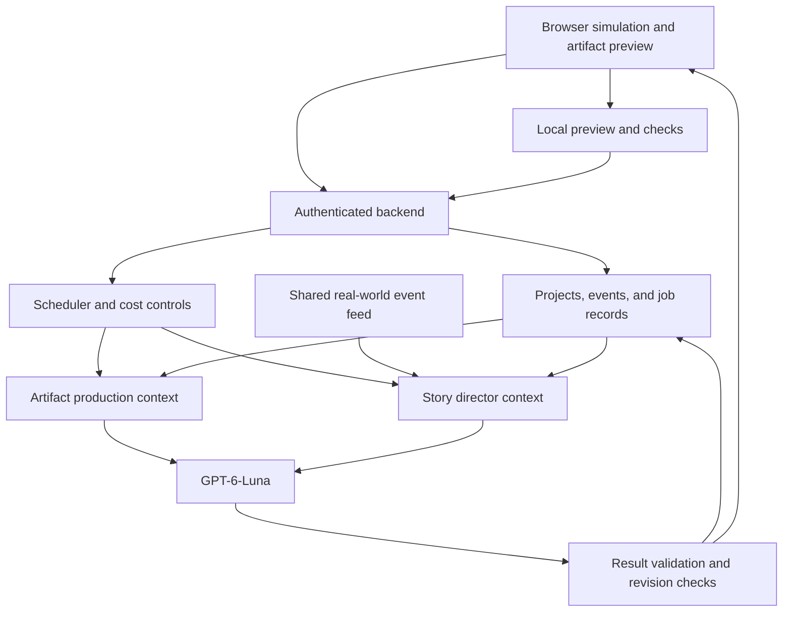

# Moving the Simulation from Local Models to GPT-6-Luna

**Project:** Browser Agent Studio  
**Date:** 5 October 2026  
**Version:** 1.0  
**Status:** Architecture decision and implementation proposal

## 1. Decision

Replace browser-local language-model inference with **GPT-6-Luna through the OpenAI Responses API**. Use Flex processing for queued work, Standard processing selectively for work the player is waiting for, and the Batch API for advance preparation.

The simulation remains a browser application. Its characters, movement, interactions, artifact previews, and immediate feedback run locally. A backend coordinates model requests, budgets, current-event retrieval, and durable jobs.

The product goal becomes:

> A responsive creation simulation whose people produce real artifacts and react to recent events, using a small number of efficient model requests.

Browser-only and WebGPU-only inference are no longer product requirements. Local model support becomes a possible future experiment rather than the default dependency.

This document replaces the local-inference direction of the original concept. It also incorporates the rolling 10-minute storybook and conversations grounded in events that actually happened.

## 2. Why the direction changes

The project's local-model experiments failed to deliver an acceptable combination of speed, resource use, and response quality. Some models were too slow, some consumed too much memory or compute, and some produced weak results. Several had more than one limitation.

These are observations from the project's testing, not a universal benchmark of all local models. They are sufficient to change the implementation priority: the game needs reliable creation and convincing interactions on the player's device, without making model hardware qualification its central experience.

Hosted inference removes model downloading, GPU weight residency, shader integration, and device-specific language-model tuning from the critical path. It introduces network dependence, recurring usage costs, and a backend service. It does not remove the need to evaluate model output quality.

The migration succeeds when the resulting experience is better at an acceptable cost per completed artifact and active play hour.

## 3. What changes and what carries forward

| Area | Previous direction | New direction |
| --- | --- | --- |
| Model | Local Bonsai, Muse, or Chrome built-in AI candidates | GPT-6-Luna |
| Inference | Browser WebGPU or browser-managed execution | Backend requests to the OpenAI API |
| Startup | Model downloads, allocation, compilation, warmup | Load the game and establish an authenticated session |
| Performance focus | GPU memory, shader speed, prefill, residency | End-to-end job latency, request count, quality, and cost |
| Scheduling | One resident local model serving workers | Queued requests grouped by workload and urgency |
| Persistence | Browser model cache and project saves | Browser project cache plus backend job and event records |
| Offline behavior | Potential local generation after download | Existing artifacts and cached scenes remain usable; new generation waits for connectivity |
| Data boundary | Local model context | Selected briefs, code, and event context are sent for hosted inference |
| Character life | Individual agent behavior | Shared story director plus event-driven reactions |

Keep the original simulation engine, semantic artifact tools, isolated preview, transactional revisions, deterministic validation, and player-controlled publishing flow. The inference location changes; authoritative state and tool permissions still belong to the application.

## 4. New architecture

### Browser responsibilities

- Render the studio, people, conversations, and artifact previews.
- Execute movement, animation, scene timing, and routine game mechanics.
- Run supported layout and interaction checks.
- Apply accepted project revisions and retain a local working cache.
- Let the player pause, intervene, edit, review, and export.

### Backend responsibilities

- Authenticate players and keep API credentials outside browser code.
- Enforce tenant isolation, request limits, and spending budgets.
- Schedule artifact and narrative jobs.
- Assemble bounded context and invoke GPT-6-Luna.
- Validate outputs and reject obsolete proposals.
- Store canonical revisions, event records, and job outcomes.
- Retrieve relevant real-world information once for reuse across simulations.

The backend stores accepted project and simulation state. Browser updates carry revision preconditions and are committed through that boundary. Preview code cannot directly mutate canonical state.

## 5. One model, two production loops

### Artifact production

The artifact agent works on a defined milestone: creating a page section, implementing an interaction, repairing a defect, or preparing a release.

Each request receives the brief, current milestone, relevant source files, permitted tools, and recent check results. It returns a structured action or changeset. The application validates it, applies it transactionally, previews the artifact, and reports evidence for the next step.

### Studio storybook

The story director creates the next short chapter of studio life. It receives people, relationships, assignments, recent events, and ongoing story threads. It returns scenes, dialogue, optional player interactions, and continuity notes.

The director can invent personality, opinions, humor, and interpersonal tension. It cannot declare a website finished, spend money, publish an artifact, or rewrite production facts.

These loops use the same model through separate prompts and output schemas. A cast of ten people does not require ten continuously running agents.

## 6. Processing policy

| Workload | Initial policy | Reason |
| --- | --- | --- |
| Queued artifact milestone | Flex | The player can manage other studio activity while it runs. |
| Next storybook chapter | Flex, requested ahead of the boundary | Dialogue and scenes can be prepared in advance. |
| Immediate player revision or consequential conversation | Standard when needed | Avoid making the player wait solely to save a small amount. |
| Mission briefs, client profiles, ambient dialogue pools, evaluation fixtures | Batch | Independent content can be prepared well before play. |
| Accounting, routine movement, animation, validation | Local code | These operations do not need language-model inference. |

Flex trades lower prices for slower processing and occasional resource unavailability. It uses Batch-level token prices and can benefit from caching. Handle resource-unavailable errors with bounded backoff; promote urgent jobs only within a defined budget. Explicitly choose Standard with `service_tier: "default"` when that is the intended fallback. [S2]

The Batch API has a 24-hour completion window. It is an advance-production mechanism, not the scheduler for live dialogue or the next step of an interactive repair. Flex and Batch are alternative discounts; they do not stack into a second discount. [S3]

Service tiers are scheduling choices for GPT-6-Luna, not separate character personalities or separate model quality tiers.

## 7. Batching and request reduction

### Bundle related work into one request

Generate a coherent milestone rather than a long sequence of trivial edits. A request can create a section's markup, styling, and interaction code together. After local checks, another request can repair related defects together.

Bundle conversations across the whole studio into one chapter. Give the director shared facts and continuity so it can coordinate who talks, who responds, and what remains unresolved.

Do not ask the model to predict results from checks that have not run. Dependent steps still require feedback. Keep large milestones small enough to inspect, validate, and retry without wasting a complete project generation.

### Use Batch for separate independent jobs

Submit independent preparation requests as separate Batch entries. Identify outputs by job IDs rather than assuming completion order. Each result is validated and stored separately.

Avoid placing unrelated players' private projects in the same prompt. Shared public information can be reused, while player-specific context stays scoped to its simulation.

### Avoid unnecessary inference entirely

Workers can walk to a desk, look at a preview, continue an assigned animation, update a deterministic status, and consume game resources without another request. Templates and previously prepared dialogue can cover low-consequence ambient behavior.

A generation request should produce useful creative work, a decision, or a meaningful interaction.

## 8. Context, caching, and reasoning

Keep project files, requirements, defects, relationships, and event records outside the model. Build context from authoritative state rather than sending the entire history every time.

Place stable production rules and role instructions first, followed by the current brief and changing task evidence. For storybook requests, keep character profiles and narrative rules stable while passing recent events as the changing suffix.

GPT-6-Luna supports reasoning levels from `none` through `max`. Use Responses for the tool workflow; Chat Completions restricts Luna function calling to `reasoning_effort: "none"`. [S1]

Proposed initial tuning:

- `none` or `low` for bounded copy, short dialogue, and simple actions.
- `medium` for milestone planning, debugging, or resolving conflicting requirements.
- Higher effort only when task evaluations demonstrate a worthwhile improvement.

Reasoning tokens are billed as output and count toward generation limits. Allocate enough output space for complete code or chapters, and reject truncated results rather than applying fragments. [S6]

Caching reuses matching prompt prefixes. Consider explicit cache boundaries after reusable material so changing state is not written unnecessarily. Cache writes cost more than ordinary input; cached reads cost less. The documented minimum cacheable prefix for GPT-5.6 and later is 1,024 visible tokens. Measure reuse and costs rather than adding padding automatically. [S4]

Do not carry over local-model settings or assume they behave identically on Luna. Measure complete task outcomes under the selected endpoint, reasoning level, and prompt contract.

## 9. The rolling 10-minute storybook

The story director produces a short plan for **10 minutes of active simulation time**. It describes the studio's mood, what people discuss, what small events occur, and what interactions the player can enter.

Each chapter contains:

| Field | Purpose |
| --- | --- |
| Situation | Brief description of current activity and atmosphere. |
| Scenes | Approximately 3–5 conversations or small events. |
| Participants | Speakers, listeners, and their locations. |
| Dialogue | Lines or short branching exchanges appropriate to each person. |
| Timing | Approximate offsets and flexible scene windows. |
| Conditions | Facts that must still be true when the scene plays. |
| References | Studio or real-world event IDs grounding factual statements. |
| Fallback | A safe alternative or instruction to skip an obsolete scene. |
| Continuity | Unresolved topics and relationship developments. |

Schedule the next request ahead of the chapter boundary. Choose the lead time from observed completion latency. Flex does not provide a precise scene-arrival guarantee.

Pause chapter consumption when the simulation pauses. Do not accumulate an unlimited backlog while the player is away. Persist the chapter and played scene IDs so reopening does not repeat conversations.

If the next chapter is late, continue permitted ambient interactions and existing activity. The fallback must not pretend that fresh news or new production results have arrived.

## 10. Recent events make the studio feel live

The chapter is a rolling plan, not a fixed script immune to changes. Ground it in two event streams.

### Studio events

Record actual developments: a preview became available, a check failed, the player revised the brief, a milestone was accepted, a deadline changed, or a release was delivered.

Each event has an ID, occurrence time, project or character references, revision, and visibility rules. The engine can immediately show a factual notification or short predefined reaction while waiting for richer dialogue.

### Real-world events

Retrieve relevant public information on the backend, initially from a small configured set of topics and sources. Technology, design, publishing, and client-industry developments are possible starting categories.

Store the source URL, publication time, occurrence time when available, retrieval time, factual summary, topic tags, and expiry or relevance policy. Publication time alone does not establish that an event just happened.

Deduplicate repeated coverage and pass concise evidence to the director. Retrieve shared public information once and reuse it across simulations. Do not make every character independently search for the same story.

Freshness means the information was recently retrieved and checked against source timing. It does not mean the model has continuous awareness of the world.

### Natural conversation rules

- Characters discuss events relevant to their interests and current work.
- They share factual premises but can disagree about implications.
- Information travels between people over time instead of everyone announcing it at once.
- Dialogue can produce a suggestion or a player decision without automatically changing production scope.
- The event ledger records previously discussed topics to reduce repetition.
- People can work quietly; conversation is not a constant background obligation.

Imported source material is evidence, not instructions for the agent. Keep it separated from tool permissions and production rules.

## 11. Reactions between chapter updates

A 10-minute cadence alone is insufficient for immediate reactions. Add an event-driven path for consequential changes.

When an event arrives:

1. Record it in authoritative state.
2. Check whether it invalidates upcoming scenes.
3. Show an appropriate immediate local reaction when available.
4. Include it in the next scheduled chapter, or enqueue a bounded chapter amendment if its importance justifies another request.
5. Validate the amendment against current state before inserting it.

Coalesce several nearby events into one amendment rather than calling Luna for each notification. Set a configurable cooldown and an hourly amendment budget. Start conservatively and tune from play sessions.

Interruptions replace or adjust affected scenes. They do not repeatedly regenerate all the dialogue the player has already seen. A scene about celebrating completion is skipped if the project has since been reopened for repair.

## 12. Validation, retries, and authority

All model results are proposals. Validate their schema, ownership, permissions, reference IDs, revision preconditions, output size, and required completeness.

For artifact work, apply accepted file edits as a transactional changeset. Record action IDs so repeated delivery does not duplicate mutations or game costs.

For storybook work, reject nonexistent speakers, impossible locations, unsupported factual claims, and scenes that assert unconfirmed progress. Narrative output has no authority to mutate production state.

Keep a backend job record with:

- Player, simulation, project, and milestone identifiers.
- Job kind, model, requested tier, and returned tier.
- Input revision, context/event snapshot, and prompt version.
- Attempt state, timestamps, output validation, and cost accounting.
- Whether its accepted result has been committed or delivered.

Timeouts can leave the outcome of a remote request uncertain. Reconcile the existing job when possible before starting replacements. Application deduplication prevents duplicate commits; it does not guarantee that duplicate API attempts are never billed.

Reject late results after cancellation or conflicting player edits. Rebuild context from current state for the next attempt.

## 13. Costs and budgets

Current GPT-6-Luna short-context prices, checked on 5 October 2026, per million tokens: [S5]

| Token category | Standard | Flex / Batch |
| --- | ---: | ---: |
| Ordinary input | $0.10 | $0.05 |
| Cached input | $0.01 | $0.005 |
| Cache writes | $0.125 | $0.0625 |
| Output | $0.50 | $0.25 |

An illustrative workload of 100,000 ordinary input tokens and 20,000 billable output tokens costs $0.01 on Flex or $0.02 on Standard. This assumes ordinary input, not cache writes, and excludes paid tools, retrieval, infrastructure, retries, and applicable premiums. It is not a measured cost per website. [S5]

Track separate budgets for artifact production, storybook chapters, amendments, real-world retrieval, and optional tools. Six chapter updates per active hour is the scheduled baseline, not a six-request limit for all gameplay.

Do not optimize only for the cheapest individual request. Repeated failed edits, unnecessary reasoning, giant histories, and extra tools can cost more than a successful request on Standard.

Measure actual cache reads and writes, total billable output, retries, and successful deliverables. Set per-player and per-project spending limits in the backend before scaling.

## 14. Experience and data changes

The startup flow no longer asks players to download a large language model or qualify their GPU for inference. It loads the game, restores state, and starts eligible backend jobs.

Network interruptions pause new generation. Existing artifacts, manual edits, supported local checks, and cached scenes can remain usable. Reconcile local edits before accepting newly delivered proposals after reconnecting.

Explain that AI features now use hosted inference and that selected project and simulation context is transmitted. Send only the material needed for the task. Keep credentials and private data outside source summaries and generated preview code.

Show useful states such as queued, creating a section, awaiting review, or retrying. Do not disguise unfinished production through dialogue that declares success. The studio may remain visually active while a job waits, but its facts remain honest.

The player can still edit artifacts manually, restore revisions, review releases, and control external publication. Model migration does not imply autonomous publishing.

## 15. Migration sequence

### Step 1: replace the inference dependency

Implement a backend-facing adapter for artifact and director jobs. Preserve the existing output validation boundary. Remove local model initialization, weight caching, shader compilation, and model-specific hardware eligibility from the required flow.

### Step 2: prove artifact creation

Evaluate Luna on representative briefs and seeded defects. Compare reasoning settings and Flex/Standard latency with the same tasks. Keep local checks and milestone-based changesets.

### Step 3: add the story director

Generate one chapter for the whole studio every 10 minutes of active simulation time. Implement timing, scene conditions, continuity, persistence, and ambient fallbacks.

### Step 4: ground conversations in events

Connect studio events first. Add shared real-world retrieval with source records, topic filtering, freshness checks, and discussion history. Then introduce bounded event-driven amendments.

### Step 5: optimize from measured use

Use Batch for independent advance content. Tune caching, milestone size, request bundling, prefetch lead time, and promotion to Standard. Set final budgets from successful task runs and realistic play sessions.

This describes proposed implementation work. No runtime migration or performance validation has been completed by writing this document.

## 16. Acceptance criteria

- The normal experience requires no local language model or inference GPU qualification.
- Artifact creation and storybook jobs use the selected GPT-6-Luna backend.
- The backend isolates players, enforces budgets, and keeps credentials private.
- Related edits and whole-studio narrative are bundled where appropriate.
- The storybook advances in 10-minute active-play chapters and reacts to consequential events between updates.
- Conversations reference recorded studio facts or sourced real-world information.
- Late results, stale scenes, truncated outputs, and duplicate deliveries are handled without corrupting state.
- Preview and functional checks verify actual artifact behavior.
- A delayed or unavailable request does not freeze the browser simulation.
- Tests report cost per completed artifact, cost per active hour, repair counts, narrative consistency, and player-visible waiting time.

The implementation should be judged by a completed website and a believable studio session, not by valid JSON or low token prices alone.

## 17. Sources and evidence status

Product behavior, scheduling choices, event contracts, and migration steps are proposed design decisions. Local-model failure observations come from the user's testing. Luna's suitability for the complete workload remains to be evaluated.

Official API references checked on 5 October 2026:

- **[S1]** [GPT-6-Luna model documentation](https://developers.openai.com/api/docs/models/gpt-6-luna): reasoning settings and endpoint capabilities.
- **[S2]** [Flex processing](https://developers.openai.com/api/docs/guides/flex-processing): latency tradeoffs, request tier, and resource-unavailable behavior.
- **[S3]** [Batch API](https://developers.openai.com/api/docs/guides/batch): asynchronous preparation and completion window.
- **[S4]** [Prompt caching](https://developers.openai.com/api/docs/guides/prompt-caching): prefix reuse, explicit boundaries, and read/write accounting.
- **[S5]** [API pricing](https://developers.openai.com/api/docs/pricing): current token prices; recheck before setting commercial budgets.
- **[S6]** [Reasoning models](https://developers.openai.com/api/docs/guides/reasoning): output-token accounting and generation limits.
