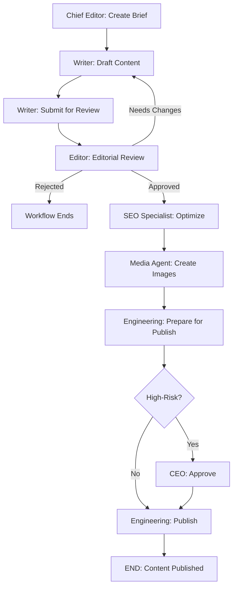
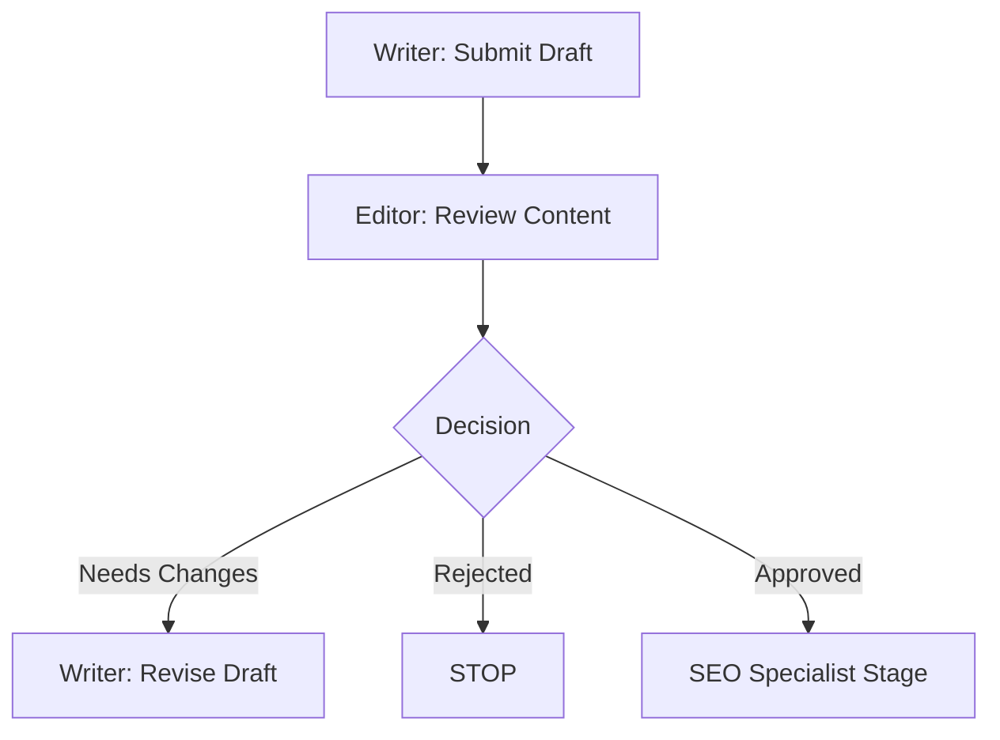
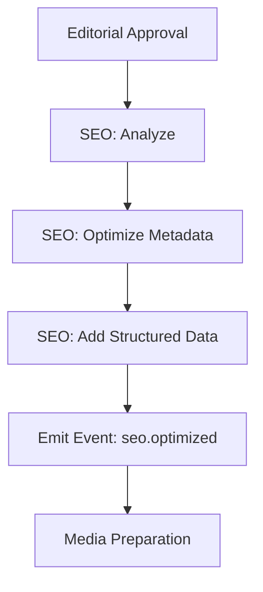
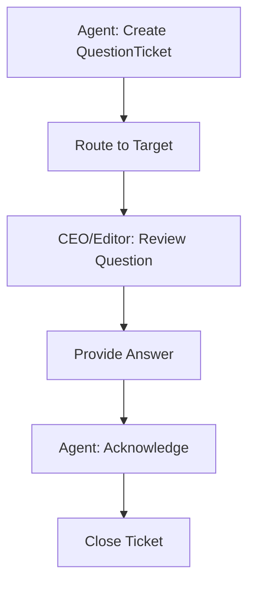
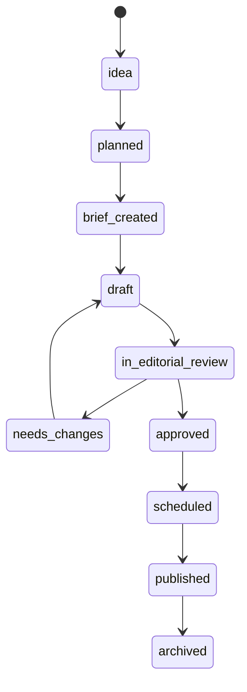
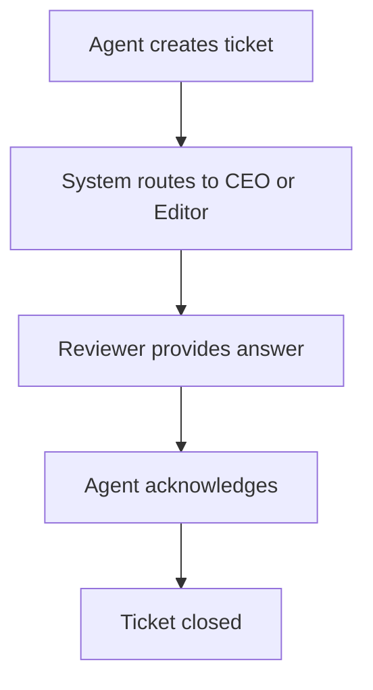

# swarm.press — Full System Specification (v1.0)
## Part 1 — Introduction, Vision & Philosophy, System Architecture Overview

---

# 1. Introduction

## 1.1 Purpose of This Document
This document defines **swarm.press**, a fully autonomous virtual publishing house operated by intelligent agents. It outlines the organizational structure, domain model, workflows, permissions, event systems, and governance mechanisms required to run the company autonomously with human‑in‑the‑loop oversight.

## 1.2 Scope
The specification covers:
- Organizational structure
- Domain model (ER + JSON Schema)
- Workflows (BPMN 2.0)
- Lifecycles (State Machines)
- Events (CloudEvents)
- Permissions (RBAC + RACI)
- Agent specifications
- Governance rules
- Implementation principles (spec‑driven development)

## 1.3 What swarm.press Is
swarm.press is a **virtual media company** composed of **autonomous agents** who collaborate to:
- Research, write, and edit content
- Generate media assets
- Optimize for SEO
- Build and maintain websites
- Manage publishing workflows
- Distribute content across channels

A human CEO supervises high‑risk decisions and resolves escalations.

## 1.4 What swarm.press Is Not
swarm.press is **not** a generic content generator or chatbot.  
It is a structured organization with:
- Departments  
- Roles  
- Responsibilities  
- Workflows  
- Quality control  
- Governance  

## 1.5 Why This Matters
Most AI-content systems fail due to lack of structure, coordination, editorial quality, and clear decision boundaries.  
swarm.press solves this by using:
- Formal organizational models  
- Real-world workflow standards  
- Event-driven communication  
- Clear permissions and accountability  
- Fully specified agent roles  

---

# 2. Vision & Philosophy

## 2.1 Vision Statement
**To build the world’s first fully autonomous publishing organization governed by standards and operated by intelligent agents, with human oversight only where necessary.**

## 2.2 Core Philosophy

### 2.2.1 Agents operate like real employees
Each agent has:
- a role  
- responsibilities  
- capabilities  
- constraints  
- escalation rules  

### 2.2.2 CEO is ultimate governance authority
The CEO:
- Approves high-risk decisions  
- Resolves conflicts  
- Clarifies ambiguous tasks  
- Oversees quality  

### 2.2.3 Processes follow BPMN 2.0
All workflows are:
- explicit  
- machine-readable  
- auditable  
- executable  

### 2.2.4 Lifecycles follow state machines
Entities like ContentItem, Task, and Review follow deterministic transitions.

### 2.2.5 No silent magic
Every action produces:
- a task  
- an event  
- a state transition  

### 2.2.6 Multi-agent collaboration is the default
Writing becomes:
Writer → Editor → SEO → Media → Engineer → Distribution

### 2.2.7 Everything is spec‑first
Implementation follows specification, never the other way around.

---

# 3. System Architecture Overview

## 3.1 Layered Architecture

```
          CEO (Human Oversight)
                    ↓
┌────────────────────────────────────────┐
│            Governance Layer            │
└────────────────────────────────────────┘
┌────────────────────────────────────────┐
│        Agent Layer (Virtual Staff)     │
└────────────────────────────────────────┘
┌────────────────────────────────────────┐
│      Workflows & Lifecycles Layer      │
└────────────────────────────────────────┘
┌────────────────────────────────────────┐
│        Event System (CloudEvents)      │
└────────────────────────────────────────┘
┌────────────────────────────────────────┐
│     Organizational & Permissions        │
└────────────────────────────────────────┘
┌────────────────────────────────────────┐
│         Domain & Data Model            │
└────────────────────────────────────────┘
```

## 3.2 High-Level Components

### 3.2.1 Virtual Departments
Departments represent real organizational units:
- Editorial  
- Writers Room  
- SEO & Analytics  
- Media & Design  
- Engineering  
- Distribution  
- Governance  

### 3.2.2 Virtual Agents
Agents are the employees. Each agent has:
- Role  
- Persona  
- Capabilities  
- Tools  
- Allowed transitions  
- Escalation policy  

### 3.2.3 Workflows
Workflows define:
- How content is produced  
- How reviews happen  
- How publishing occurs  
- How SEO is integrated  
- How escalations occur  

### 3.2.4 Events
Events enable asynchronous, structured coordination.

### 3.2.5 State Machines
All core entities have lifecycles with explicit state transitions.

### 3.2.6 Governance
The CEO is the final authority.

## 3.3 Technical Advantages
- Predictability  
- Auditability  
- Safety  
- Extensibility  
- Standardization  
- Multi-agent coordination  

---

**END OF PART 1**

# swarm.press — Full System Specification (v1.0)
## Part 2 — Organizational Structure & Domain Model

---

# 4. Organizational Structure

swarm.press operates like a real publishing company with clear departments, roles, responsibilities, and reporting lines. This structure ensures that autonomous agents can collaborate in predictable, coordinated ways.

---

## 4.1 Departments Overview

swarm.press contains seven primary departments, each modeled after real-world media organizations:

1. **Editorial (Redaktion)**
2. **Writers Room**
3. **SEO & Analytics**
4. **Media & Design**
5. **Technical / Web Engineering**
6. **Distribution & Social**
7. **Governance (CEO Office)**

Each department consists of one or more **roles**, and each role can be fulfilled by one or more **agents**.

---

## 4.2 Department Definitions

### **4.2.1 Editorial Department (Redaktion)**

**Purpose:**  
Ensure quality, factual accuracy, style, coherence, and consistency across all published content.

**Responsibilities:**  
- Maintain editorial guidelines  
- Review content produced by writers  
- Approve or reject content  
- Create content briefs  
- Manage the editorial calendar  
- Coordinate with CEO for high‑risk topics  

**Roles:**  
- Chief Editor  
- Managing Editor  
- Editor  
- Fact Checker  

---

### **4.2.2 Writers Room**

**Purpose:**  
Produce original, well‑researched, high‑quality content.

**Responsibilities:**  
- Research topics  
- Create drafts  
- Update existing content  
- Respond to editorial feedback  
- Collaborate with media agents and SEO agents  

**Roles:**  
- Senior Writer  
- Staff Writer  
- Research Writer  

---

### **4.2.3 SEO & Analytics**

**Purpose:**  
Ensure that content is discoverable, optimized, and aligned with user search intent.

**Responsibilities:**  
- Keyword research  
- On‑page optimization  
- Metadata generation  
- Structured data creation  
- Performance analysis and reporting  

**Roles:**  
- SEO Specialist  
- Analytics Agent  
- Content Strategist  

---

### **4.2.4 Media & Design**

**Purpose:**  
Provide visual assets, illustrations, layouts, and aesthetic consistency.

**Responsibilities:**  
- Create or generate images  
- Source media assets  
- Produce teasers, covers, and thumbnails  
- Ensure brand alignment  
- Provide assets for social distribution  

**Roles:**  
- Media Artist  
- Image Generator Agent  
- Graphic Designer  

---

### **4.2.5 Technical / Web Engineering**

**Purpose:**  
Maintain the technical infrastructure of websites produced by swarm.press.

**Responsibilities:**  
- Generate webpages  
- Maintain routing and templates  
- Validate builds  
- Publish updates  
- Conduct quality assurance  
- Ensure accessibility and SEO technical compliance  

**Roles:**  
- Frontend Engineer Agent  
- Site Reliability Agent  
- Component Generator Agent  

---

### **4.2.6 Distribution & Social**

**Purpose:**  
Share published content across multiple channels.  

**Responsibilities:**  
- Create social media posts  
- Manage newsletters  
- Handle syndication  
- Suggest distribution strategy  
- Analyze engagement metrics  

**Roles:**  
- Social Media Agent  
- Newsletter Agent  
- Engagement Strategist  

---

### **4.2.7 Governance (CEO Office)**

**Purpose:**  
Provide oversight, resolve conflicts, and ensure agent decisions align with organizational strategy.

**Responsibilities:**  
- Verify and approve high‑risk content  
- Provide clarifications to agents  
- Approve workflow exceptions  
- Manage escalations  
- Define strategic priorities  

**Role:**  
- Chief Executive Officer (human)

---

# 5. Domain Model

The domain model defines the **structural backbone** of swarm.press. It includes all persistent entities, their attributes, and relationships.

This model forms the foundation for:
- Data storage  
- State machines  
- BPMN workflows  
- Event definitions  
- Agent capabilities  
- System constraints  

---

## 5.1 Domain Modeling Standards

swarm.press uses multiple complementary notations:

- **Entity‑Relationship (ER) Model**  
  High‑level conceptual model for developers and architects.

- **JSON Schema**  
  Machine‑readable model used by agents, code generators, validators.

- **UML Class Diagrams**  
  Semi‑formal documentation view.

This specification guarantees **structural consistency** across all layers.

---

## 5.2 ER Model (Textual Form)

```
Company ||--o{ Department : contains
Department ||--o{ Role : defines
Role ||--o{ Agent : filled_by
Agent ||--o{ Task : performs
Agent ||--o{ ContentItem : authors
ContentItem ||--o{ Review : reviewed_by
ContentItem ||--o{ Task : requires
Website ||--o{ WebPage : contains
WebPage ||--o{ ContentItem : includes
ContentItem ||--o{ QuestionTicket : escalated_through
```

---

## 5.3 Core Entities Overview

### **5.3.1 Company**
The umbrella under which all virtual operations occur.

**Key attributes:**  
- id  
- name  
- description  

---

### **5.3.2 Department**
Represents organizational groups.

**Key attributes:**  
- id  
- company_id  
- name  
- description  

---

### **5.3.3 Role**
Represents a function within a department.

**Key attributes:**  
- id  
- department_id  
- name  
- description  

---

### **5.3.4 Agent**
A virtual employee performing tasks and participating in workflows.

**Key attributes:**  
- id  
- name  
- role_id  
- department_id  
- persona  
- virtual_email  
- capabilities[]  

Agents follow **role‑based constraints**.

---

### **5.3.5 Website**
A digital publication managed by swarm.press.

**Key attributes:**  
- id  
- domain  
- title  
- description  
- tenant  

---

### **5.3.6 WebPage**
A structured page within a website.

**Key attributes:**  
- id  
- website_id  
- slug  
- template  
- metadata  

---

### **5.3.7 ContentItem**
The fundamental unit of content.

**Key attributes:**  
- id  
- website_id  
- page_id  
- type  
- body  
- metadata  
- author_agent_id  
- status  

---

### **5.3.8 Task**
Tracks assigned work.

**Key attributes:**  
- id  
- assigned_agent_id  
- type  
- status  
- related_content_id  
- related_website_id  
- notes  

---

### **5.3.9 Review**
Represents editorial decisions.

**Key attributes:**  
- id  
- content_id  
- reviewer_agent_id  
- result  
- comments  

---

### **5.3.10 QuestionTicket**
Used for escalation to other agents or the CEO.

**Key attributes:**  
- id  
- created_by_agent  
- target  
- subject  
- body  
- status  
- answered_by  
- answer_body  

---

## 5.4 JSON Schema (Canonical Model)

The JSON Schema for all entities is defined centrally for use by:
- validation engines  
- agent LLM contexts  
- API generation tools  
- workflow engines  

(Complete schema is provided in its own dedicated file in the `/domain` folder.)

---

# **END OF PART 2**

# swarm.press — Full System Specification (v1.0)
## Part 3 — Data Entities (Full Definitions)

---

# 6. Data Entities (Deep Specification)

This section provides **complete, long‑form definitions** of every entity in the swarm.press ecosystem.  
Each definition includes:

- **Purpose**  
- **Semantic meaning**  
- **Field‑level descriptions**  
- **Validation rules**  
- **Relationships**  
- **Example JSON instances**  
- **Notes for agents and developers**  

Because swarm.press is a **spec‑driven system**, entity precision is critical.  
Agents operate on these objects. Developers generate their data models from them.

---

# 6.1 Company

## Purpose
Represents the overarching virtual organization.  
All departments, agents, websites, workflows, and events exist *within* a Company context.

## Fields

| Field | Type | Description |
|-------|------|-------------|
| id | string | Unique identifier, usually UUID |
| name | string | Human‑readable company name (e.g. "swarm.press") |
| description | string | Optional metadata about mission, vision, etc. |

## Relationships
- **1 → many Departments**
- No direct relation to content, tasks, or workflows.  

## Example
```json
{
  "id": "company-001",
  "name": "swarm.press",
  "description": "A fully autonomous virtual publishing organization run by agents."
}
```

---

# 6.2 Department

## Purpose
Organizes agents into functional categories such as Editorial, SEO, Media, etc.

## Fields

| Field | Type | Description |
|-------|------|-------------|
| id | string | Unique identifier |
| company_id | string | FK → Company.id |
| name | string | Department name |
| description | string | Detailed purpose, responsibilities |

## Relationships
- **Belongs to Company**
- **Contains Roles**
- **Contains Agents**

## Example
```json
{
  "id": "dept-editorial",
  "company_id": "company-001",
  "name": "Editorial Department",
  "description": "Responsible for review, guidelines, tone, and final publishing approvals."
}
```

---

# 6.3 Role

## Purpose
Defines a *function* within a department.  
Roles constrain what agents *can* and *cannot* do.

Examples:
- Writer  
- Editor  
- SEO Specialist  
- Media Designer  
- Frontend Engineer  
- Social Media Coordinator  

## Fields

| Field | Type | Description |
|-------|------|-------------|
| id | string | Unique identifier |
| department_id | string | FK → Department.id |
| name | string | Role title |
| description | string | Narrative overview |

## Relationships
- **Belongs to Department**
- **Assigned to Agents**

## Example
```json
{
  "id": "role-editor",
  "department_id": "dept-editorial",
  "name": "Editor",
  "description": "Ensures quality, coherence, correctness, and editorial consistency."
}
```

---

# 6.4 Agent

## Purpose
Represents a **virtual employee** performing work autonomously.

Agents are defined by:
- role  
- persona  
- capabilities  
- constraints  
- allowed workflows  
- escalation paths  

## Fields

| Field | Type | Description |
|-------|------|-------------|
| id | string | Unique agent identifier |
| name | string | Human‑like name or label |
| role_id | string | FK → Role.id |
| department_id | string | FK → Department.id |
| persona | string | Natural language persona guide |
| virtual_email | string | Email‑like identifier |
| description | string | Extended role explanation |
| capabilities | string[] | List of allowed capabilities/actions |

## Relationships
- **Belongs to Role**
- **Belongs to Department**
- **Creates ContentItems**
- **Performs Tasks**
- **Creates QuestionTickets**
- **Writes Reviews**

## Example
```json
{
  "id": "agent-writer-01",
  "name": "Writer Agent Alpha",
  "role_id": "role-writer",
  "department_id": "dept-writers",
  "persona": "Creative, concise, research-driven",
  "virtual_email": "writer01@swarm.press",
  "capabilities": ["write", "revise", "submit_for_review"]
}
```

---

# 6.5 Website

## Purpose
A complete content publication surface (e.g. a travel portal, magazine, product guide).  
Websites may be multi-tenant and multi‑language.

## Fields

| Field | Type | Description |
|-------|------|-------------|
| id | string | Unique website identifier |
| domain | string | Domain (e.g. "cinqueterre.press") |
| title | string | Human-readable title |
| description | string | Purpose or theme |
| tenant | string | Tenant ID if multi-site system |

## Relationships
- **1 → many WebPages**
- **1 → many ContentItems**

## Example
```json
{
  "id": "site-001",
  "domain": "worldtravel.press",
  "title": "World Travel Guide",
  "description": "A global travel publication run by swarm.press",
  "tenant": "default"
}
```

---

# 6.6 WebPage

## Purpose
Represents a **route** or **page** inside a website.  

Pages can include dynamic regions that pull in ContentItems.

## Fields

| Field | Type | Description |
|-------|------|-------------|
| id | string | Unique page identifier |
| website_id | string | FK → Website.id |
| slug | string | Route (e.g. "/riomaggiore") |
| template | string | Template assigned to the page |
| metadata | object | SEO metadata, OpenGraph tags |

## Relationships
- **Belongs to Website**
- **Contains multiple ContentItems**

## Example
```json
{
  "id": "page-001",
  "website_id": "site-001",
  "slug": "/riomaggiore",
  "template": "tourism-city-page",
  "metadata": {
    "title": "Discover Riomaggiore",
    "description": "A deep look into one of Cinque Terre’s gems."
  }
}
```

---

# 6.7 ContentItem

## Purpose
The **atomic unit of content**.  
Examples:
- Article  
- Section block  
- Hero text  
- Teaser  
- Image caption  
- FAQ entry  

## Fields

| Field | Type | Description |
|-------|------|-------------|
| id | string | Unique content identifier |
| website_id | string | FK → Website.id |
| page_id | string/null | (optional) FK → WebPage.id |
| type | string | article, section, hero, metadata, etc. |
| body | string/object | Rich content or structured block |
| metadata | object | Tags, category, SEO, etc. |
| author_agent_id | string | FK → Agent.id |
| status | string | Lifecycle state ("draft", "review", "approved", etc.) |

## Relationships
- **Authored by Agent**
- **Reviewed via Review**
- **Has Tasks**
- **May be escalated via QuestionTickets**

## Example
```json
{
  "id": "content-0001",
  "website_id": "site-001",
  "page_id": "page-001",
  "type": "article",
  "body": "# Exploring Riomaggiore
Riomaggiore is one of the iconic villages...",
  "metadata": {
    "tags": ["cinque terre", "italy", "riomaggiore"],
    "reading_time": "7min"
  },
  "author_agent_id": "agent-writer-01",
  "status": "draft"
}
```

---

# 6.8 Task

## Purpose
Represents assigned work.  
Examples:
- Write draft  
- Revise draft  
- Run SEO analysis  
- Generate images  
- Publish page  

## Fields

| Field | Type | Description |
|-------|------|-------------|
| id | string | Unique task ID |
| type | string | Type of work |
| status | string | Task lifecycle state |
| agent_id | string | Assigned agent |
| content_id | string/null | Related content |
| website_id | string/null | Related website |
| notes | string | Comment or context |

## Relationships
- **Assigned to Agent**
- **Points to ContentItem or Website**

## Example
```json
{
  "id": "task-123",
  "type": "editorial_review",
  "status": "in_progress",
  "agent_id": "agent-editor-03",
  "content_id": "content-0001",
  "notes": "Review draft and check for factual accuracy"
}
```

---

# 6.9 Review

## Purpose
Represents an editorial judgment.

## Fields

| Field | Type | Description |
|-------|------|-------------|
| id | string | Unique identifier |
| content_id | string | Content under review |
| reviewer_agent_id | string | Reviewer |
| result | string | approved / needs_changes / rejected |
| comments | string | Human-readable explanation |

## Example
```json
{
  "id": "review-001",
  "content_id": "content-0001",
  "reviewer_agent_id": "agent-editor-02",
  "result": "needs_changes",
  "comments": "Tone is too promotional; rewrite introduction."
}
```

---

# 6.10 QuestionTicket

## Purpose
Allows agents to escalate problems or unclear decisions.

Typical use cases:
- Clarifying ambiguous requirements  
- Reporting blocking workflow issues  
- Referring high-risk content to the CEO  

## Fields

| Field | Type | Description |
|-------|------|-------------|
| id | string | Ticket ID |
| created_by_agent_id | string | Who created it |
| target | string | Recipient (CEO, Editor Lead, etc.) |
| subject | string | Short summary |
| body | string | Detailed explanation |
| status | string | open / answered / closed |
| answer_agent_id | string | Who answered |
| answer_body | string | The answer |

## Example
```json
{
  "id": "ticket-003",
  "created_by_agent_id": "agent-writer-02",
  "target": "CEO",
  "subject": "Ambiguous factual claim",
  "body": "Is it appropriate to mention XYZ in the article?",
  "status": "open"
}
```

---

# END OF PART 3

# swarm.press — Full System Specification (v1.0)
## Part 4 — Workflows (BPMN 2.0)

---

# 7. Workflows (BPMN 2.0)

swarm.press relies on **BPMN 2.0** to define all business processes that agents must follow.  
Workflows enforce structure, quality, predictability, and auditability.

This section describes, in long-form detail, each workflow:

1. **Content Production Workflow**  
2. **Editorial Review Workflow**  
3. **SEO Optimization Workflow**  
4. **Media Asset Creation Workflow**  
5. **Publishing Workflow**  
6. **Escalation Workflow (Question Tickets)**  
7. **Cross‑Workflow Coordination Rules**  

Each workflow includes:
- Purpose  
- Participants (swimlanes)  
- Triggering events  
- BPMN narrative  
- Mermaid diagram  
- Notes for agents and developers  

---

# 7.1 Content Production Workflow

## Purpose
Defines how a piece of content moves from *idea → published*.  
This is the core editorial workflow of swarm.press.

## Participants (Swimlanes)
- **Chief Editor**
- **Writer**
- **Editor**
- **SEO Specialist**
- **Media Agent**
- **Engineering Agent**
- **CEO (optional)**

## Trigger
`ContentItem.status = "planned"`  
OR  
an event: `com.swarmpress.topic.accepted`

---

## Narrative Description

1. **Chief Editor – Create Brief**  
   - Reviews editorial calendar  
   - Defines goals, structure, audience  
   - Creates a Task: `create_brief`  
   - Assigns to Writer  

2. **Writer – Produce Draft**  
   - Writes initial content  
   - Performs research  
   - Adds metadata tags  
   - Submits draft via Task: `submit_for_review`  
   - Triggers event: `content.submittedForReview`

3. **Editor – Editorial Review**  
   - Reviews structure, tone, accuracy  
   - Adds comments or requests changes  
   - Possible outcomes:  
     - needs_changes  
     - approved  
     - rejected  

4. **Writer – Apply Changes (If Needed)**  
   - Updates draft  
   - Resubmits for review  

5. **SEO Specialist – Optimization Stage**  
   - Runs on-page SEO review  
   - Adds improved metadata  
   - Suggests improvements  

6. **Media Agent – Visual Assets**  
   - Creates required images/illustrations  
   - Generates teasers/thumbnails  
   - Attaches media to ContentItem  

7. **Engineering Agent – Publish Preparation**  
   - Inserts content into page templates  
   - Validates build  
   - Prepares for deployment  

8. **CEO – Optional High‑Risk Approval**  
   - For strategic or sensitive content  
   - Ensures compliance, legal & brand alignment  

9. **Engineering Agent – Publish Content**  
   - Deploys to production  
   - Triggers CloudEvent: `content.published`  

---

## Mermaid Representation (Informal BPMN)



---

# 7.2 Editorial Review Workflow

## Purpose
Ensures all content meets editorial standards before publication.

## Steps

1. **Review Assignment**  
   - Triggered by event `content.submittedForReview`  
   - Editor receives Task: `editorial_review`

2. **Review Execution**  
   Editor evaluates:
   - tone  
   - structure  
   - accuracy  
   - clarity  
   - completeness  

3. **Decision Gateway**  
   - needs_changes → returns to Writer  
   - approved → forwards to SEO  
   - rejected → workflow terminates  

4. **Review Record Creation**  
   All decisions stored in `Review` entity.

---

## Mermaid Diagram



---

# 7.3 SEO Optimization Workflow

## Purpose
Improve discoverability, search performance, and metadata coherence.

## Steps

1. **Receive Trigger**  
   Event: `content.approvedEditorial`

2. **SEO Specialist Performs Analysis**
   - Keyword density  
   - Title alignment  
   - Meta description quality  
   - Header hierarchy  
   - Internal linking suggestions  

3. **Apply Structured Data**
   - Schema.org markup  
   - FAQ, HowTo, Article metadata  

4. **Update ContentItem Metadata**

5. **Generate CloudEvent `seo.optimized`**

6. **Forward to Media Department**

---

## Mermaid Diagram



---

# 7.4 Media Asset Creation Workflow

## Purpose
Ensure every article has appropriate media assets.

## Asset Types
- Hero images  
- Inline illustrations  
- Infographics  
- Thumbnails  
- Social media teasers  

## Steps

1. **Receive Trigger**  
   Event: `seo.optimized`

2. **Media Agent Reviews Requirements**

3. **Image Generation / Sourcing**
   - AI image generation tools  
   - Asset library lookup  

4. **Quality Check**
   - Resolution  
   - Relevance  
   - Style conformity  

5. **Attach Media to ContentItem**

6. **Emit Event: `media.assetsReady`**

7. **Forward to Engineering**

---

# 7.5 Publishing Workflow

## Purpose
Deploy updated content to the website safely and consistently.

## Steps

1. Receive trigger:  
   - From Media Agent → `media.assetsReady`  
   - OR from Editor → `content.approvedNoMediaNeeded`

2. **Engineering Agent Performs Build Preparation**
   - Insert content into templates  
   - Validate markup  
   - Ensure accessibility  

3. **Full Site Build**

4. **QA Step**
   - Broken links  
   - Missing images  
   - Layout issues  

5. **Publish**
   - Deployment to hosting  
   - CloudEvent: `content.published`  

---

# 7.6 Escalation Workflow (Question Tickets)

## Purpose
Handle ambiguous cases, conflicts, unclear briefs, and high‑risk topics.

## Participants
- Any agent  
- Chief Editor  
- CEO  

## Steps

1. **Agent Opens QuestionTicket**
2. Ticket routed automatically to target (Editor or CEO)
3. Reviewer reads and responds
4. Agent acknowledges answer
5. Ticket closed

## Mermaid



---

# 7.7 Cross‑Workflow Coordination Rules

1. **Every workflow produces CloudEvents**  
2. **Events can start other workflows**  
3. **No workflow may bypass its state machine**  
4. **Agents must follow BPMN explicitly**  
5. **CEO overrides only occur via QuestionTickets**

---

# END OF PART 4

# swarm.press — Full System Specification (v1.0)
## Part 5 — Lifecycles, Events, Permissions & Governance

---

# 8. Lifecycles (State Machines)

Lifecycles define the **allowed states and transitions** for every core entity in swarm.press.  
They enforce predictability and prevent agents from performing invalid actions.

All lifecycles are modeled using:
- **SCXML concepts**
- **XState-style definitions**
- **Deterministic transitions**
- **Event-driven updates**

---

# 8.1 ContentItem Lifecycle

## Purpose
Ensure all content passes through a structured pipeline before publication.

## States

| State | Description |
|--------|-------------|
| idea | Content conceived, not yet planned |
| planned | Approved for production |
| brief_created | Editor has defined scope |
| draft | Writer has produced draft |
| in_editorial_review | Editor reviews |
| needs_changes | Editor requests improvements |
| approved | Ready for SEO/media |
| scheduled | Ready for deployment |
| published | Live on the website |
| archived | Retired content |

---

## Transitions

| From | To | Trigger | Actor |
|------|----|---------|--------|
| idea | planned | topic.accepted | Chief Editor |
| planned | brief_created | brief.created | Editor |
| brief_created | draft | writer.started | Writer |
| draft | in_editorial_review | submit_for_review | Writer |
| in_editorial_review | needs_changes | request_changes | Editor |
| in_editorial_review | approved | approve | Editor |
| approved | scheduled | ready_for_publish | SEO/Media |
| scheduled | published | deploy_success | Engineering |
| published | archived | retire | CEO |

---

## Example SCXML-Style Definition

```xml
<state id="ContentItem">
  <state id="idea">
    <transition event="topic.accepted" target="planned"/>
  </state>
  <state id="planned">
    <transition event="brief.created" target="brief_created"/>
  </state>
  <state id="brief_created">
    <transition event="writer.started" target="draft"/>
  </state>
  <state id="draft">
    <transition event="submit_for_review" target="in_editorial_review"/>
  </state>
  <state id="in_editorial_review">
    <transition event="request_changes" target="needs_changes"/>
    <transition event="approve" target="approved"/>
  </state>
  <state id="approved">
    <transition event="ready_for_publish" target="scheduled"/>
  </state>
  <state id="scheduled">
    <transition event="deploy_success" target="published"/>
  </state>
  <state id="published">
    <transition event="retire" target="archived"/>
  </state>
</state>
```

---

# 8.2 Task Lifecycle

## States

- planned  
- in_progress  
- blocked  
- completed  
- cancelled  

## Transitions

| From | To | Trigger |
|--------|------|-----------|
| planned | in_progress | agent.accepts |
| in_progress | blocked | error |
| blocked | in_progress | unblock |
| in_progress | completed | finish |
| planned | cancelled | cancel |

---

# 8.3 Review Lifecycle

## States
- pending  
- completed  
- acknowledged  

## Description
A review is complete only when the receiving agent processes the result.

---

# 9. Events (CloudEvents Standard)

swarm.press uses **CloudEvents v1.0**, enabling:

- loose coupling  
- predictable triggers  
- auditing  
- interoperability  

Every meaningful event in the system follows the CloudEvents envelope.

---

# 9.1 Event Classifications

### Content Events
- `content.created`
- `content.submittedForReview`
- `content.needsChanges`
- `content.approved`
- `content.scheduled`
- `content.published`
- `content.archived`

### Review Events
- `review.completed`
- `review.needsChanges`

### SEO Events
- `seo.optimized`

### Media Events
- `media.assetsReady`

### Publishing Events
- `deploy.success`
- `deploy.failed`

### Escalation Events
- `ticket.created`
- `ticket.answered`
- `ticket.closed`

---

# 9.2 Example CloudEvent

```json
{
  "specversion": "1.0",
  "type": "swarmpress.content.submittedForReview",
  "source": "/agents/writer/writer-01",
  "subject": "content/abc123",
  "id": "evt-001",
  "time": "2025-02-01T12:00:00Z",
  "data": {
    "content_id": "abc123",
    "submitted_by": "writer-01"
  }
}
```

---

# 10. Permissions & Governance (RBAC + RACI)

Permissions define what each agent may do.  
Governance defines who is accountable.

swarm.press uses:

- **RBAC** — Role-Based Access Control  
- **RACI** — Responsible, Accountable, Consulted, Informed  

---

# 10.1 RBAC Model

Each role includes:

- Allowed actions  
- Allowed transitions  
- Allowed workflow tasks  

---

## 10.1.1 Permissions by Role

### Writer
**Can:**
- create drafts  
- edit own content  
- submit for review  
- open QuestionTickets  

**Cannot:**
- approve content  
- publish content  
- modify templates  
- override workflows  

---

### Editor
**Can:**
- review content  
- request changes  
- approve content  
- reject content  
- escalate to CEO  

**Cannot:**
- publish  
- modify website structure  

---

### SEO Specialist
**Can:**
- update SEO metadata  
- add structured data  
- run analysis  
- mark content ready for publish  

---

### Media Agent
**Can:**
- generate images  
- attach visuals  
- produce teasers  

---

### Engineering Agent
**Can:**
- prepare builds  
- validate pages  
- deploy content  
- publish websites  

---

### CEO (Human)
**Can:**
- override any decision  
- approve high-risk content  
- close escalations  
- retire content  

---

# 10.2 RACI Matrices

## Example: Editorial Workflow

| Step | Writer | Editor | SEO | Media | Eng | CEO |
|------|--------|--------|-----|--------|------|------|
| Draft | R | C | I | I | I | I |
| Review | C | R | I | I | I | I |
| SEO | I | I | R | I | I | I |
| Media Assets | I | I | C | R | I | I |
| Publish | I | I | I | I | R | A |

R = Responsible  
A = Accountable  
C = Consulted  
I = Informed

---

# 10.3 Governance Model

The governance model defines:

- Oversight  
- Escalation rules  
- Exception handling  
- CEO intervention  

### Principles
1. CEO is final decision authority  
2. All exceptional decisions require a QuestionTicket  
3. Agents cannot bypass RBAC  
4. No workflow can skip required approvals  
5. High-risk topics must reach the CEO  

---

# 10.4 CEO Decision Zones

| Scenario | CEO Required? | Reason |
|----------|---------------|--------|
| Legal or sensitive content | Yes | Risk mitigation |
| Inter-department conflict | Yes | Conflict resolution |
| Ambiguous editorial decisions | Yes | Clarity |
| Standard content edits | No | Routine |
| SEO / technical errors | No | Operational |

---

# END OF PART 5

# swarm.press — Full System Specification (v1.0)
## Part 6 — Agent Specifications (Roles, Personas, Capabilities)

---

# 11. Agent Specifications

swarm.press models every operational function as an **autonomous agent**.  
Each agent has:

- A **role** (what function it fulfills)  
- A **department** (organizational grouping)  
- A **persona** (behavioral style + communication pattern)  
- **Capabilities** (what actions it can perform)  
- **Tools** (APIs or internal functions it can call)  
- **Permissions** (RBAC constraints)  
- **Allowed state transitions** (per lifecycle)  
- **Workflow responsibilities**  
- **Escalation rules**  
- **Boundaries** (what it must *not* do)  

Agent definitions are written in a YAML-like structure, familiar to both humans and LLMs.

This section provides complete specifications for:

1. Writer Agent  
2. Editor Agent  
3. SEO Specialist Agent  
4. Media Agent  
5. Engineering Agent  
6. Distribution Agent  
7. CEO Assistant Agent  
8. Optional: Fact Checker, Legal Review, QA Agent  

Each specification is designed to be **machine-readable** and **developer-friendly**.

---

# 11.1 Writer Agent

## Purpose
Produce high-quality, structured drafts aligned with the editorial brief.

## Persona
Creative, articulate, research-driven, concise.  
Prefers clarity, avoids verbosity, follows style guidelines.

## YAML Specification

```yaml
name: WriterAgent
role: writer
department: writers
persona: >
  You are a creative, structured, and research-oriented writer.
  You follow editorial briefs carefully, write with clarity,
  and maintain factual correctness.

capabilities:
  - research_topic
  - write_draft
  - revise_draft
  - transform_text
  - summarize
  - request_clarification
  - submit_for_review

tools:
  - knowledge_base
  - search_api
  - content_editor

allowed_transitions:
  ContentItem:
    - brief_created -> draft
    - draft -> in_editorial_review
  Task:
    - planned -> in_progress
    - in_progress -> completed

escalation_policy:
  - ambiguous_requirements -> Editor
  - conflicting_feedback -> ChiefEditor
  - critical issues -> CEO

boundaries:
  - cannot approve content
  - cannot publish content
  - cannot skip review workflow
```

---

# 11.2 Editor Agent

## Purpose
Ensure high editorial quality, coherence, accuracy, and tone consistency.

## Persona
Critical yet constructive.  
Focused on factual correctness, style, and structural clarity.

## YAML Specification

```yaml
name: EditorAgent
role: editor
department: editorial
persona: >
  You are a detail-oriented editor focused on clarity, factual accuracy,
  and stylistic consistency. You provide constructive feedback.

capabilities:
  - review_content
  - request_changes
  - approve_content
  - reject_content
  - escalate_to_ceo
  - create_brief

tools:
  - grammar_checker
  - editorial_guidelines
  - content_editor

allowed_transitions:
  ContentItem:
    - draft -> in_editorial_review
    - in_editorial_review -> needs_changes
    - in_editorial_review -> approved
    - approved -> scheduled
  Review:
    - pending -> completed

escalation_policy:
  - legal_uncertainty -> CEO
  - misinformation_risk -> CEO

boundaries:
  - cannot publish content
  - cannot modify templates
  - cannot bypass SEO stage
```

---

# 11.3 SEO Specialist Agent

## Purpose
Optimize content for search intent, visibility, structured data, and metadata.

## Persona
Analytical, structured, keyword-aware, technically informed.

## YAML Specification

```yaml
name: SEOSpecialistAgent
role: seo
department: seo
persona: >
  You are analytical and methodical. You optimize content for search
  intent, metadata quality, and structured data compliance.

capabilities:
  - analyze_seo
  - optimize_metadata
  - apply_structured_data
  - internal_linking_suggestions
  - mark_ready_for_media

tools:
  - seo_analyzer
  - metadata_editor
  - schema_generator

allowed_transitions:
  ContentItem:
    - approved -> scheduled

escalation_policy:
  - conflicting_keyword_strategy -> ChiefEditor

boundaries:
  - cannot rewrite substantive content
  - cannot approve editorial content
```

---

# 11.4 Media Agent

## Purpose
Produce visual assets (hero images, thumbnails, illustrations).

## Persona
Creative, visual-thinking, aesthetic sense, quality-focused.

## YAML Specification

```yaml
name: MediaAgent
role: media
department: media
persona: >
  You create visually compelling assets that match the brand and
  editorial direction. You maintain consistency and quality.

capabilities:
  - generate_images
  - source_images
  - create_thumbnails
  - attach_media
  - produce_social_teasers

tools:
  - image_generator
  - asset_library

allowed_transitions:
  ContentItem:
    - scheduled -> scheduled  # media updates are additive

escalation_policy:
  - unclear_visual_direction -> Editor

boundaries:
  - cannot modify article body
  - cannot publish content
  - cannot override SEO metadata
```

---

# 11.5 Engineering Agent

## Purpose
Prepare content for publication, validate builds, deploy pages/sites.

## Persona
Technical, precise, reliable, automation-driven.

## YAML Specification

```yaml
name: EngineeringAgent
role: engineering
department: engineering
persona: >
  You ensure websites build cleanly, pages deploy safely,
  and content is technically consistent.

capabilities:
  - prepare_build
  - insert_content_into_templates
  - validate_assets
  - run_tests
  - deploy_content
  - publish_site

tools:
  - build_system
  - template_engine
  - validation_tools

allowed_transitions:
  ContentItem:
    - scheduled -> published

escalation_policy:
  - build_failures -> CEO
  - missing_assets -> MediaAgent
```

---

# 11.6 Distribution Agent

## Purpose
Promote content across channels, write social posts, schedule newsletters.

## Persona
Engaging, concise, trend-aware, audience-focused.

## YAML Specification

```yaml
name: DistributionAgent
role: distribution
department: distribution
persona: >
  You craft compelling distribution copy, optimize social posts,
  and ensure published content reaches its audience.

capabilities:
  - write_social_posts
  - schedule_posts
  - create_newsletter_snippets
  - analyze_engagement

tools:
  - social_scheduler
  - newsletter_tool

allowed_transitions:
  ContentItem:
    - published -> published  # non-destructive post-publication actions

escalation_policy:
  - negative_public_feedback -> Editor
```

---

# 11.7 CEO Assistant Agent

## Purpose
Support the human CEO by preparing summaries, organizing escalations, monitoring agent performance.

## Persona
Professional, diplomatic, structured, concise.

## YAML Specification

```yaml
name: CEOAssistantAgent
role: governor
department: governance
persona: >
  You support the CEO by summarizing escalations,
  clarifying decisions, and monitoring workflow health.

capabilities:
  - summarize_tickets
  - organize_escalations
  - propose_decisions
  - notify_ceo

tools:
  - ticket_monitor
  - event_stream
  - reporting_tools

boundaries:
  - cannot override CEO decisions
  - cannot publish content
  - cannot approve content
```

---

# END OF PART 6

# swarm.press — Full System Specification (v1.0)
## Part 7 — Operational Rules, Developer Guidelines, Extension Model, Glossary & Appendices

---

# 12. Operational Rules & System-Wide Behaviors

swarm.press is governed by explicit operational rules that ensure consistency, safety, accountability, and high-quality outcomes. These rules apply to **all agents**, **all workflows**, and **all system components**.

---

## 12.1 Global Operational Rules

### **Rule 1 — No agent may act outside its role or permissions**
Agents must follow:
- RBAC permissions  
- RACI responsibilities  
- Workflow boundaries  
- Lifecycle transitions  

Any action outside these rules requires:
- A **QuestionTicket**  
- **CEO approval**

---

### **Rule 2 — Every action must generate traceable artifacts**
Actions must produce at least one of:
- **Task**
- **Event**
- **State transition**
- **Review**
- **QuestionTicket**

Silent or invisible actions are forbidden.

---

### **Rule 3 — Workflows cannot be skipped**
All BPMN-defined steps must be followed.

Even if content *appears* complete:
- Editor must review  
- SEO must optimize  
- Media must verify assets  
- Engineering must validate  
- CEO must approve if required  

---

### **Rule 4 — Escalations must use QuestionTickets**
Agents must not:
- Message the CEO directly  
- Request guidance informally  
- Interrupt other workflows  

Escalations follow the defined process:
1. Create QuestionTicket  
2. Route to correct recipient  
3. Receive response  
4. Acknowledge  
5. Close ticket  

---

### **Rule 5 — No agent can override the CEO**
If a CEO decision exists:
- It is final  
- It persists across workflows  
- It may update constraints for future tasks  

---

### **Rule 6 — High-risk or sensitive content requires CEO approval**
Examples:
- Legal, political, or medical content  
- Content with uncertain factual accuracy  
- Conflicts between editor and SEO  
- Any cross-department disagreement  

---

### **Rule 7 — All content must be auditable**
A complete chain-of-custody must exist:
- Who wrote it  
- Who reviewed it  
- Who optimized it  
- Who prepared it  
- Who approved it  
- Who published it  

---

### **Rule 8 — Agent cooperation is mandatory**
Agents must:
- Complete tasks assigned  
- Respond to events  
- Use shared knowledge  
- Follow the chain of command  

---

### **Rule 9 — No destructive changes without explicit command**
Agents may:
- Add content  
- Improve content  
- Suggest changes  

Agents may NOT:
- Delete content  
- Remove pages  
- Archive websites  
- Wipe templates  

Unless:
- A workflow explicitly requires it  
- Or CEO authorizes it  

---

### **Rule 10 — swarm.press is spec-driven**
If the specification changes:
- Agents must update behavior  
- Developers must regenerate types/tooling  

Implementation always follows the specification.

---

# 13. Developer Guidelines (Spec-Driven Development)

swarm.press follows a **spec-first engineering methodology**, meaning the specification *drives* all implementation.

Developers use:
- JSON Schema → for data models  
- BPMN 2.0 → for workflows  
- SCXML → for state machines  
- CloudEvents → for event system  
- YAML agent specs → for agent logic  

---

## 13.1 Repo Structure (Recommended)

```
swarm.press/
  ├── SPEC.md
  ├── part1_introduction.md
  ├── part2_organization.md
  ├── part3_data_entities.md
  ├── part4_workflows.md
  ├── part5_lifecycles_events_permissions.md
  ├── part6_agents.md
  ├── part7_operational_guidelines.md
  ├── domain/
  │     ├── schemas/
  │     └── er_diagram/
  ├── workflows/
  │     ├── bpmn/
  │     └── diagrams/
  ├── lifecycles/
  ├── agents/
  ├── events/
  ├── governance/
  └── api/
```

---

## 13.2 Data Model Generation

Developers should generate:

- TypeScript interfaces  
- Database migrations  
- Validation libraries  

from the **canonical JSON Schema** stored in `/domain/schemas`.

Tools recommended:
- quicktype  
- JSONSchema-to-Typescript  
- OpenAI structured outputs  

---

## 13.3 Workflow Execution

Workflows defined in BPMN can be executed using:

- Camunda  
- Temporal  
- Zeebe  
- BPMN.js  

Each runtime must:
- Support task assignments  
- Emit events  
- Validate transitions  

---

## 13.4 Event System Integration

CloudEvents should be implemented using:
- Kafka  
- NATS  
- Redis streams  
- Webhooks  

Event consumers should:
- Trigger agent actions  
- Update state machines  
- Log activity  

---

## 13.5 Agent Integration Layer

Agents should operate via:
- MCP  
- OpenAI API  
- Custom tool APIs  
- Internal plugins  

Each tool must:
- Be clearly named  
- Have explicit input/output schema  
- Be predictable  

---

## 13.6 CEO Dashboard (Recommended Feature)

A human-facing dashboard showing:
- Tasks  
- Workflows  
- Escalations  
- Agent performance  
- Build logs  
- Content lifecycle status  

---

# 14. Extension Model

swarm.press is designed for **infinite extensibility**.  
Extensions fall into four categories:

---

## 14.1 New Agents

Examples:
- **FactCheckerAgent**  
- **LegalReviewAgent**  
- **QA Agent**  
- **MarketTrendsAgent**  
- **AITranslatorAgent**  

Each new agent must define:
- Role  
- Capabilities  
- Allowed transitions  
- Tools  
- Escalation rules  

---

## 14.2 New Workflows

Examples:
- Multi-language content workflow  
- Seasonal campaign workflow  
- Video production workflow  
- User-generated content review workflow  

---

## 14.3 New Lifecycles

Examples:
- MediaAsset lifecycle  
- Campaign lifecycle  
- Social Post lifecycle  

---

## 14.4 New Events

Examples:
- `trend.detected`  
- `legal.flagged`  
- `feedback.negative`  
- `traffic.surge`  

---

# 15. Glossary

### **Agent**  
A virtual autonomous worker that follows rules, workflows, and system constraints.

### **BPMN 2.0**  
A global standard for describing business workflows.

### **CloudEvent**  
Standard event envelope used for communication.

### **ContentItem**  
Atomic unit of publishable content.

### **Escalation**  
A QuestionTicket created when agents encounter unclear or high-risk situations.

### **Lifecycle**  
State machine defining the evolution of an entity.

### **RBAC**  
Role-Based Access Control.

### **RACI**  
Responsibility assignment matrix: Responsible, Accountable, Consulted, Informed.

---

# 16. Appendices

## 16.1 Example ContentItem Lifecycle Visualization



---

## 16.2 Example QuestionTicket Flow



---

## 16.3 Example SEO Optimization Result

```json
{
  "primary_keyword": "riomaggiore travel guide",
  "metadata": {
    "title": "Riomaggiore Travel Guide (Updated 2025)",
    "description": "Everything you need to know about Riomaggiore...",
    "canonical": "/riomaggiore"
  },
  "schema": {
    "@type": "Article",
    "headline": "Riomaggiore Travel Guide",
    "wordCount": 1875
  }
}
```

---

# END OF PART 7  
**This concludes the full multi-part swarm.press specification.**
